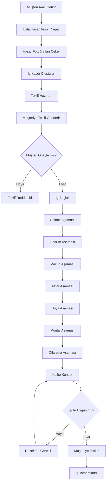
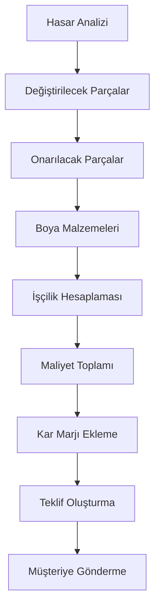
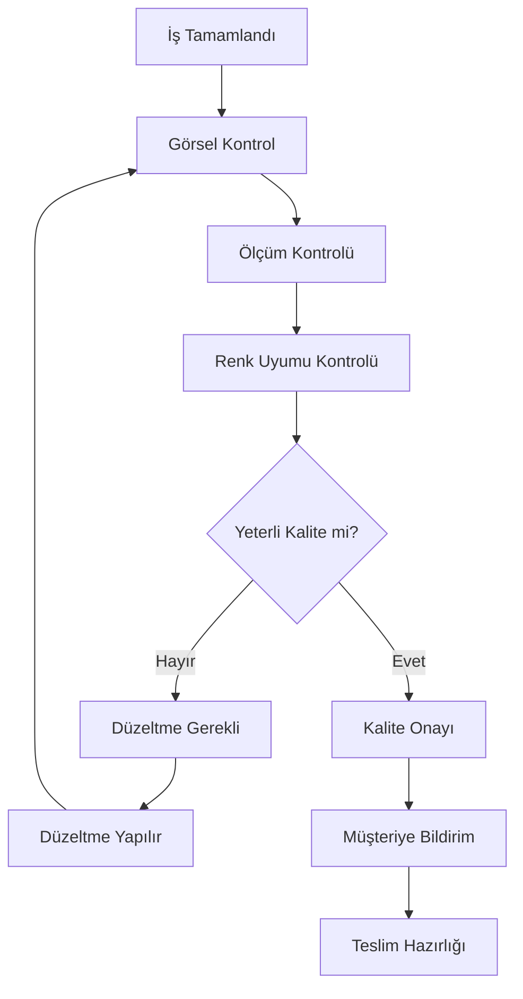

# Kaporta/Boya Modülü - Detaylı Dokümantasyon

## 📋 Genel Bakış

Kaporta/Boya modülü, araç kaportası ve boya işlemlerini yöneten kapsamlı bir sistemdir. Bu modül, görsel odaklı teklif hazırlama, çok aşamalı iş akışı takibi, aşama bazlı fotoğraf yükleme ve şeffaf maliyet analizi gibi özellikler sunar.

## 🏗️ Mimari Yapı

### Backend Modelleri

#### 1. BodyworkJob Model
```typescript
interface IBodyworkJob {
  _id: ObjectId;
  mechanicId: ObjectId; // Usta kimliği
  customerId: ObjectId; // Müşteri kimliği
  vehicleId: ObjectId; // Araç kimliği
  
  // Hasar bilgileri
  damageInfo: {
    description: string; // Hasar açıklaması
    photos: string[]; // Hasar fotoğrafları
    videos?: string[]; // Hasar videoları
    damageType: 'collision' | 'scratch' | 'dent' | 'rust' | 'paint_damage' | 'other';
    severity: 'minor' | 'moderate' | 'major' | 'severe';
    affectedAreas: string[]; // Etkilenen bölgeler
    estimatedRepairTime: number; // Tahmini onarım süresi (saat)
  };
  
  // Teklif bilgileri
  quote: {
    totalAmount: number; // Toplam tutar
    breakdown: {
      partsToReplace: Array<{
        partName: string;
        partNumber?: string;
        brand: string;
        quantity: number;
        unitPrice: number;
        totalPrice: number;
        notes?: string;
      }>;
      partsToRepair: Array<{
        partName: string;
        laborHours: number;
        laborRate: number;
        totalPrice: number;
        notes?: string;
      }>;
      paintMaterials: Array<{
        materialName: string;
        quantity: number;
        unitPrice: number;
        totalPrice: number;
        notes?: string;
      }>;
      laborCost: number;
      materialCost: number;
      totalCost: number;
    };
    validityDays: number; // Geçerlilik süresi (gün)
    createdAt: Date;
    status: 'draft' | 'sent' | 'approved' | 'rejected';
  };
  
  // İş akışı
  workflow: {
    stages: Array<{
      stage: 'disassembly' | 'repair' | 'putty' | 'primer' | 'paint' | 'assembly' | 'polishing';
      status: 'pending' | 'in_progress' | 'completed' | 'skipped';
      startDate?: Date;
      endDate?: Date;
      photos: string[];
      notes?: string;
      assignedTo?: ObjectId;
    }>;
    currentStage: 'disassembly' | 'repair' | 'putty' | 'primer' | 'paint' | 'assembly' | 'polishing';
    estimatedCompletionDate?: Date;
    actualCompletionDate?: Date;
  };
  
  // Müşteri onayları
  customerApprovals: Array<{
    stage: string;
    approved: boolean;
    photos: string[];
    notes: string;
    approvedDate?: Date;
  }>;
  
  // Kalite kontrol
  qualityCheck: {
    passed: boolean;
    checkedBy: string;
    issues: string[];
    photos: string[];
    notes?: string;
    checkedDate?: Date;
  };
  
  // Ödeme bilgileri
  payment: {
    totalAmount: number;
    paidAmount: number;
    remainingAmount: number;
    paymentStatus: 'pending' | 'partial' | 'completed';
    paymentMethod?: string;
    paymentDate?: Date;
  };
  
  // Durum
  status: 'quote_preparation' | 'quote_sent' | 'quote_approved' | 'in_progress' | 'completed' | 'cancelled';
  
  // Metadata
  createdAt: Date;
  updatedAt: Date;
}
```

#### 2. BodyworkTemplate Model
```typescript
interface IBodyworkTemplate {
  _id: ObjectId;
  mechanicId: ObjectId; // Usta kimliği
  
  // Şablon bilgileri
  name: string; // Şablon adı
  description: string; // Şablon açıklaması
  damageType: 'collision' | 'scratch' | 'dent' | 'rust' | 'paint_damage' | 'other';
  severity: 'minor' | 'moderate' | 'major' | 'severe';
  
  // İş akışı şablonu
  workflowTemplate: Array<{
    stage: 'disassembly' | 'repair' | 'putty' | 'primer' | 'paint' | 'assembly' | 'polishing';
    estimatedHours: number;
    requiredSkills: string[];
    materials: string[];
    notes?: string;
  }>;
  
  // Standart fiyatlandırma
  standardPricing: {
    partsToReplace: Array<{
      partName: string;
      brand: string;
      quantity: number;
      unitPrice: number;
    }>;
    partsToRepair: Array<{
      partName: string;
      laborHours: number;
      laborRate: number;
    }>;
    paintMaterials: Array<{
      materialName: string;
      quantity: number;
      unitPrice: number;
    }>;
  };
  
  // İşçilik oranları
  laborRates: {
    hourlyRate: number;
    overtimeRate: number;
    weekendRate: number;
  };
  
  // Metadata
  createdAt: Date;
  updatedAt: Date;
}
```

## 🔧 Backend Servisleri

### BodyworkService

#### Ana Metodlar

##### 1. createJob()
```typescript
static async createJob(data: {
  mechanicId: string;
  customerId: string;
  vehicleId: string;
  damageInfo: {
    description: string;
    photos: string[];
    videos?: string[];
    damageType: 'collision' | 'scratch' | 'dent' | 'rust' | 'paint_damage' | 'other';
    severity: 'minor' | 'moderate' | 'major' | 'severe';
    affectedAreas: string[];
    estimatedRepairTime: number;
  };
})
```

**İşlevi:** Yeni kaporta/boya işi oluşturur.

**İşlem Adımları:**
1. Hasar bilgilerini kaydeder
2. İş akışı aşamalarını oluşturur
3. Başlangıç durumunu ayarlar
4. İş kaydını oluşturur

**Dönüş Değeri:**
```typescript
{
  success: boolean;
  data: IBodyworkJob;
  message: string;
}
```

##### 2. prepareQuote()
```typescript
static async prepareQuote(jobId: string, quoteData: {
  partsToReplace: Array<{
    partName: string;
    partNumber?: string;
    brand: string;
    quantity: number;
    unitPrice: number;
    notes?: string;
  }>;
  partsToRepair: Array<{
    partName: string;
    laborHours: number;
    laborRate: number;
    notes?: string;
  }>;
  paintMaterials: Array<{
    materialName: string;
    quantity: number;
    unitPrice: number;
    notes?: string;
  }>;
  validityDays?: number;
})
```

**İşlevi:** Teklif hazırlar ve maliyet hesaplar.

**İşlem Adımları:**
1. Parça maliyetlerini hesaplar
2. İşçilik maliyetlerini hesaplar
3. Boya malzeme maliyetlerini hesaplar
4. Toplam maliyeti hesaplar
5. Teklifi kaydeder

##### 3. sendQuote()
```typescript
static async sendQuote(jobId: string)
```

**İşlevi:** Teklifi müşteriye gönderir.

**İşlem Adımları:**
1. Teklif durumunu kontrol eder
2. Durumu 'sent' olarak günceller
3. Müşteriye bildirim gönderir

##### 4. updateWorkflowStage()
```typescript
static async updateWorkflowStage(jobId: string, stageData: {
  stage: string;
  status: 'in_progress' | 'completed' | 'skipped';
  photos?: string[];
  notes?: string;
  assignedTo?: string;
})
```

**İşlevi:** İş akışı aşamasını günceller.

**İşlem Adımları:**
1. Aşamayı bulur
2. Durumu günceller
3. Fotoğrafları ekler
4. Notları kaydeder
5. İş durumunu günceller

##### 5. requestCustomerApproval()
```typescript
static async requestCustomerApproval(jobId: string, stage: string, photos?: string[])
```

**İşlevi:** Müşteri onayı ister.

**İşlem Adımları:**
1. Onay kaydı oluşturur
2. Müşteriye bildirim gönderir
3. Onay beklemeye alır

##### 6. performQualityCheck()
```typescript
static async performQualityCheck(jobId: string, checkData: {
  passed: boolean;
  checkedBy: string;
  issues?: string[];
  photos?: string[];
  notes?: string;
})
```

**İşlevi:** Kalite kontrol yapar.

**İşlem Adımları:**
1. Kalite kontrol kaydı oluşturur
2. Sorunları kaydeder
3. Fotoğrafları ekler
4. İş durumunu günceller

##### 7. createTemplate()
```typescript
static async createTemplate(mechanicId: string, templateData: {
  name: string;
  description: string;
  damageType: 'collision' | 'scratch' | 'dent' | 'rust' | 'paint_damage' | 'other';
  severity: 'minor' | 'moderate' | 'major' | 'severe';
  workflowTemplate: Array<{
    stage: 'disassembly' | 'repair' | 'putty' | 'primer' | 'paint' | 'assembly' | 'polishing';
    estimatedHours: number;
    requiredSkills: string[];
    materials: string[];
    notes?: string;
  }>;
  standardPricing: {
    partsToReplace: Array<{
      partName: string;
      brand: string;
      quantity: number;
      unitPrice: number;
    }>;
    partsToRepair: Array<{
      partName: string;
      laborHours: number;
      laborRate: number;
    }>;
    paintMaterials: Array<{
      materialName: string;
      quantity: number;
      unitPrice: number;
    }>;
  };
  laborRates: {
    hourlyRate: number;
    overtimeRate: number;
    weekendRate: number;
  };
})
```

**İşlevi:** İş şablonu oluşturur.

## 🌐 API Endpoints

### Base URL: `/api/bodywork`

#### 1. POST `/create`
**Açıklama:** Yeni kaporta/boya işi oluşturur.

**Request Body:**
```json
{
  "customerId": "string",
  "vehicleId": "string",
  "damageInfo": {
    "description": "string",
    "photos": ["string"],
    "videos": ["string"],
    "damageType": "collision|scratch|dent|rust|paint_damage|other",
    "severity": "minor|moderate|major|severe",
    "affectedAreas": ["string"],
    "estimatedRepairTime": number
  }
}
```

**Response:**
```json
{
  "success": true,
  "data": {
    "_id": "string",
    "damageInfo": {...},
    "workflow": {
      "stages": [
        {
          "stage": "disassembly",
          "status": "pending",
          "estimatedHours": 2
        },
        {
          "stage": "repair",
          "status": "pending",
          "estimatedHours": 4
        }
      ],
      "currentStage": "disassembly"
    },
    "status": "quote_preparation",
    "createdAt": "2024-01-01T00:00:00.000Z"
  },
  "message": "Kaporta/boya işi başarıyla oluşturuldu"
}
```

#### 2. POST `/:jobId/prepare-quote`
**Açıklama:** Teklif hazırlar.

**Parameters:**
- `jobId` (string): İş kimliği

**Request Body:**
```json
{
  "partsToReplace": [
    {
      "partName": "string",
      "partNumber": "string",
      "brand": "string",
      "quantity": number,
      "unitPrice": number,
      "notes": "string"
    }
  ],
  "partsToRepair": [
    {
      "partName": "string",
      "laborHours": number,
      "laborRate": number,
      "notes": "string"
    }
  ],
  "paintMaterials": [
    {
      "materialName": "string",
      "quantity": number,
      "unitPrice": number,
      "notes": "string"
    }
  ],
  "validityDays": number
}
```

**Response:**
```json
{
  "success": true,
  "data": {
    "_id": "string",
    "quote": {
      "totalAmount": 1500,
      "breakdown": {
        "partsToReplace": [...],
        "partsToRepair": [...],
        "paintMaterials": [...],
        "laborCost": 800,
        "materialCost": 700,
        "totalCost": 1500
      },
      "validityDays": 30,
      "status": "draft"
    }
  },
  "message": "Teklif başarıyla hazırlandı"
}
```

#### 3. POST `/:jobId/send-quote`
**Açıklama:** Teklifi müşteriye gönderir.

**Parameters:**
- `jobId` (string): İş kimliği

**Response:**
```json
{
  "success": true,
  "data": {
    "_id": "string",
    "quote": {
      "status": "sent"
    },
    "status": "quote_sent"
  },
  "message": "Teklif müşteriye gönderildi"
}
```

#### 4. PUT `/:jobId/workflow-stage`
**Açıklama:** İş akışı aşamasını günceller.

**Parameters:**
- `jobId` (string): İş kimliği

**Request Body:**
```json
{
  "stage": "disassembly|repair|putty|primer|paint|assembly|polishing",
  "status": "in_progress|completed|skipped",
  "photos": ["string"],
  "notes": "string",
  "assignedTo": "string"
}
```

**Response:**
```json
{
  "success": true,
  "data": {
    "_id": "string",
    "workflow": {
      "stages": [
        {
          "stage": "disassembly",
          "status": "completed",
          "startDate": "2024-01-01T00:00:00.000Z",
          "endDate": "2024-01-01T02:00:00.000Z",
          "photos": ["string"],
          "notes": "string"
        }
      ],
      "currentStage": "repair"
    }
  },
  "message": "İş akışı aşaması güncellendi"
}
```

#### 5. POST `/:jobId/request-approval`
**Açıklama:** Müşteri onayı ister.

**Parameters:**
- `jobId` (string): İş kimliği

**Request Body:**
```json
{
  "stage": "string",
  "photos": ["string"]
}
```

**Response:**
```json
{
  "success": true,
  "data": {
    "_id": "string",
    "customerApprovals": [
      {
        "stage": "string",
        "approved": false,
        "photos": ["string"],
        "notes": ""
      }
    ]
  },
  "message": "Müşteri onayı istendi"
}
```

#### 6. POST `/:jobId/quality-check`
**Açıklama:** Kalite kontrol yapar.

**Parameters:**
- `jobId` (string): İş kimliği

**Request Body:**
```json
{
  "passed": boolean,
  "checkedBy": "string",
  "issues": ["string"],
  "photos": ["string"],
  "notes": "string"
}
```

**Response:**
```json
{
  "success": true,
  "data": {
    "_id": "string",
    "qualityCheck": {
      "passed": true,
      "checkedBy": "string",
      "issues": [],
      "photos": ["string"],
      "notes": "string",
      "checkedDate": "2024-01-01T00:00:00.000Z"
    },
    "status": "completed"
  },
  "message": "Kalite kontrol tamamlandı"
}
```

#### 7. POST `/templates`
**Açıklama:** İş şablonu oluşturur.

**Request Body:**
```json
{
  "name": "string",
  "description": "string",
  "damageType": "collision|scratch|dent|rust|paint_damage|other",
  "severity": "minor|moderate|major|severe",
  "workflowTemplate": [
    {
      "stage": "disassembly|repair|putty|primer|paint|assembly|polishing",
      "estimatedHours": number,
      "requiredSkills": ["string"],
      "materials": ["string"],
      "notes": "string"
    }
  ],
  "standardPricing": {
    "partsToReplace": [...],
    "partsToRepair": [...],
    "paintMaterials": [...]
  },
  "laborRates": {
    "hourlyRate": number,
    "overtimeRate": number,
    "weekendRate": number
  }
}
```

**Response:**
```json
{
  "success": true,
  "data": {
    "_id": "string",
    "name": "string",
    "description": "string",
    "damageType": "collision",
    "severity": "moderate",
    "workflowTemplate": [...],
    "standardPricing": {...},
    "laborRates": {...}
  },
  "message": "İş şablonu başarıyla oluşturuldu"
}
```

#### 8. GET `/jobs`
**Açıklama:** İşleri listeler.

**Query Parameters:**
- `status` (string): İş durumu filtresi
- `page` (number): Sayfa numarası
- `limit` (number): Sayfa başına kayıt sayısı

**Response:**
```json
{
  "success": true,
  "data": {
    "jobs": [
      {
        "_id": "string",
        "customerId": {
          "_id": "string",
          "name": "string",
          "surname": "string",
          "phone": "string"
        },
        "vehicleId": {
          "_id": "string",
          "brand": "string",
          "modelName": "string",
          "plateNumber": "string"
        },
        "damageInfo": {
          "description": "string",
          "damageType": "collision",
          "severity": "moderate"
        },
        "quote": {
          "totalAmount": 1500,
          "status": "sent"
        },
        "workflow": {
          "currentStage": "repair",
          "stages": [...]
        },
        "status": "in_progress",
        "createdAt": "2024-01-01T00:00:00.000Z"
      }
    ],
    "pagination": {
      "currentPage": 1,
      "totalPages": 5,
      "totalItems": 50,
      "itemsPerPage": 10
    }
  }
}
```

#### 9. GET `/jobs/:jobId`
**Açıklama:** Belirli bir işi getirir.

**Parameters:**
- `jobId` (string): İş kimliği

**Response:**
```json
{
  "success": true,
  "data": {
    "_id": "string",
    "customerId": {...},
    "vehicleId": {...},
    "damageInfo": {...},
    "quote": {...},
    "workflow": {...},
    "customerApprovals": [...],
    "qualityCheck": {...},
    "payment": {...},
    "status": "in_progress",
    "createdAt": "2024-01-01T00:00:00.000Z",
    "updatedAt": "2024-01-01T00:00:00.000Z"
  }
}
```

#### 10. GET `/templates`
**Açıklama:** İş şablonlarını listeler.

**Response:**
```json
{
  "success": true,
  "data": [
    {
      "_id": "string",
      "name": "string",
      "description": "string",
      "damageType": "collision",
      "severity": "moderate",
      "workflowTemplate": [...],
      "standardPricing": {...},
      "laborRates": {...},
      "createdAt": "2024-01-01T00:00:00.000Z"
    }
  ]
}
```

## 📱 Frontend Bileşenleri

### BodyworkScreen

#### Ana Özellikler
- **İş Oluşturma:** Yeni kaporta/boya işi oluşturma
- **Teklif Hazırlama:** Detaylı maliyet hesaplama
- **İş Akışı Takibi:** Aşama bazlı ilerleme takibi
- **Fotoğraf Yönetimi:** Aşama bazlı fotoğraf yükleme
- **Müşteri Onayı:** Müşteri onay sistemi
- **Kalite Kontrol:** İş tamamlama kontrolü

#### Ekran Bileşenleri

##### 1. İş Oluşturma Formu
```typescript
interface JobCreationForm {
  customerId: string;
  vehicleId: string;
  damageInfo: {
    description: string;
    photos: string[];
    videos?: string[];
    damageType: string;
    severity: string;
    affectedAreas: string[];
    estimatedRepairTime: number;
  };
}
```

##### 2. Teklif Hazırlama Paneli
```typescript
interface QuotePreparationPanel {
  partsToReplace: PartItem[];
  partsToRepair: RepairItem[];
  paintMaterials: MaterialItem[];
  totalCost: number;
  validityDays: number;
}
```

##### 3. İş Akışı Takip Paneli
```typescript
interface WorkflowTrackingPanel {
  stages: WorkflowStage[];
  currentStage: string;
  progress: number;
  estimatedCompletion: Date;
}
```

##### 4. Fotoğraf Galerisi
```typescript
interface PhotoGallery {
  stage: string;
  photos: PhotoItem[];
  uploadProgress: number;
  uploadStatus: 'idle' | 'uploading' | 'completed' | 'error';
}
```

##### 5. Maliyet Analizi Kartı
```typescript
interface CostAnalysisCard {
  laborCost: number;
  materialCost: number;
  totalCost: number;
  breakdown: CostBreakdown;
  profitMargin: number;
}
```

### BodyworkDashboard Widget

#### Dashboard Özellikleri
- **Aktif İşler:** Devam eden işlerin listesi
- **Teklif Bekleyenler:** Onay bekleyen teklifler
- **Tamamlanan İşler:** Bu hafta tamamlanan işler
- **Gelir Özeti:** Aylık gelir analizi
- **Hızlı Erişim:** Yeni iş, teklif hazırlama, şablonlar

## 🔄 İş Akışları

### 1. Kaporta/Boya İş Akışı



### 2. Teklif Hazırlama İş Akışı



### 3. Kalite Kontrol İş Akışı



## 🎯 Kullanım Senaryoları

### Senaryo 1: Çarpışma Hasarı Onarımı
1. Müşteri çarpışma hasarlı aracını getirir
2. Usta hasarı tespit eder ve fotoğraflar
3. Değiştirilecek ve onarılacak parçaları belirler
4. Teklif hazırlar ve müşteriye gönderir
5. Onay sonrası işe başlar
6. Aşama aşama ilerler ve fotoğraflar
7. Kalite kontrol yapar
8. Müşteriye teslim eder

### Senaryo 2: Çizik Onarımı
1. Müşteri çizik hasarlı aracını getirir
2. Usta çizik derinliğini ölçer
3. Boya katmanlarını analiz eder
4. Teklif hazırlar
5. Onay sonrası işe başlar
6. Çizik onarımı yapar
7. Boya işlemi yapar
8. Cilalama yapar
9. Teslim eder

### Senaryo 3: Pas Onarımı
1. Müşteri pas hasarlı aracını getirir
2. Usta pas yayılmasını kontrol eder
3. Temizleme ve onarım planı yapar
4. Teklif hazırlar
5. Onay sonrası işe başlar
6. Pas temizleme yapar
7. Anti-pas uygular
8. Boya işlemi yapar
9. Teslim eder

## 🔒 Güvenlik Özellikleri

### Kimlik Doğrulama
- JWT token tabanlı kimlik doğrulama
- Usta yetkilendirmesi
- Müşteri kimlik doğrulaması

### Veri Güvenliği
- Hassas bilgilerin şifrelenmesi
- Fotoğraf güvenliği
- API endpoint koruması

### İzleme ve Loglama
- Tüm işlemlerin loglanması
- Fotoğraf yükleme takibi
- Hata takibi

## 📊 Performans Optimizasyonları

### Veritabanı Optimizasyonları
- İndeksleme stratejileri
- Query optimizasyonu
- Fotoğraf metadata optimizasyonu

### Cache Stratejileri
- İş durumu cache'i
- Şablon cache'i
- Fotoğraf cache'i

### Ölçeklenebilirlik
- Horizontal scaling desteği
- Load balancing
- Microservice mimarisi

## 🧪 Test Stratejileri

### Unit Testler
- Servis metodları testleri
- Model validasyon testleri
- Maliyet hesaplama testleri

### Integration Testler
- API endpoint testleri
- Fotoğraf yükleme testleri
- İş akışı testleri

### E2E Testler
- Kullanıcı senaryoları testleri
- Frontend-backend entegrasyon testleri
- Performans testleri

## 🚀 Deployment ve DevOps

### Environment Konfigürasyonu
- Development environment
- Staging environment
- Production environment

### CI/CD Pipeline
- Automated testing
- Code quality checks
- Automated deployment

### Monitoring ve Alerting
- Application monitoring
- Performance monitoring
- Error tracking
- Uptime monitoring

## 📈 Gelecek Geliştirmeler

### Planlanan Özellikler
- AI destekli hasar analizi
- 3D görselleştirme
- Otomatik fiyatlandırma
- AR destekli onarım rehberi

### Teknoloji Güncellemeleri
- Computer vision entegrasyonu
- Machine learning modelleri
- Real-time collaboration
- Advanced analytics

---

*Bu dokümantasyon Kaporta/Boya modülünün tüm özelliklerini ve kullanım senaryolarını kapsamaktadır. Güncellemeler için lütfen dokümantasyonu takip ediniz.*
