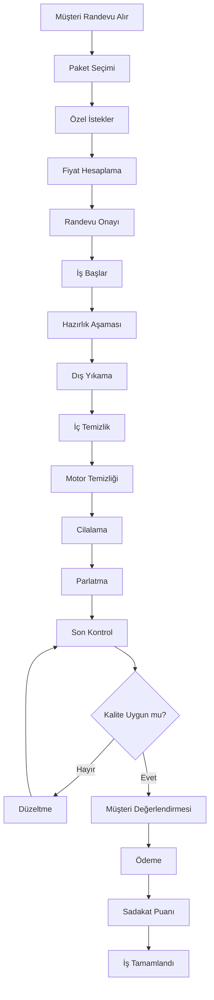
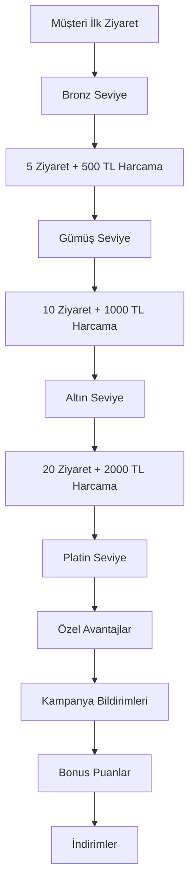
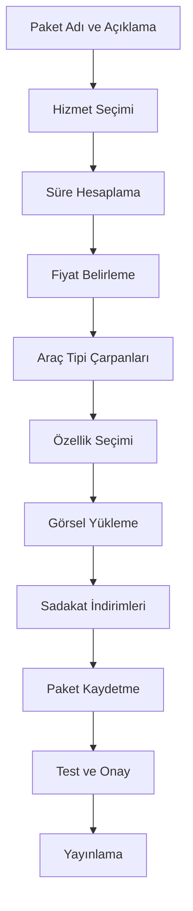

# Oto Yıkama Modülü - Detaylı Dokümantasyon

## 📋 Genel Bakış

Oto Yıkama modülü, araç yıkama ve detaylandırma hizmetlerini yöneten kapsamlı bir sistemdir. Bu modül, hizmet paketleri sistemi, sadakat programı, detaylı zaman yönetimi ve çoklu hizmet takibi gibi özellikler sunar.

## 🏗️ Mimari Yapı

### Backend Modelleri

#### 1. CarWashPackage Model
```typescript
interface ICarWashPackage {
  _id: ObjectId;
  mechanicId: ObjectId; // Usta kimliği
  
  // Paket bilgileri
  name: string; // Paket adı
  description: string; // Paket açıklaması
  packageType: 'basic' | 'premium' | 'deluxe' | 'detailing' | 'custom';
  
  // Paket içeriği
  services: Array<{
    serviceName: string; // Hizmet adı
    serviceType: 'exterior' | 'interior' | 'engine' | 'special';
    duration: number; // Süre (dakika)
    price: number; // Fiyat
    description: string; // Açıklama
    isOptional: boolean; // Opsiyonel mi?
    order: number; // Sıra
  }>;
  
  // Fiyatlandırma
  pricing: {
    basePrice: number; // Temel fiyat
    vehicleTypeMultipliers: {
      car: number; // Otomobil çarpanı
      suv: number; // SUV çarpanı
      truck: number; // Kamyon çarpanı
      motorcycle: number; // Motosiklet çarpanı
      van: number; // Van çarpanı
    };
    duration: number; // Toplam süre (dakika)
    maxDuration: number; // Maksimum süre (dakika)
  };
  
  // Sadakat indirimleri
  loyaltyDiscounts: Array<{
    loyaltyLevel: 'bronze' | 'silver' | 'gold' | 'platinum';
    discountPercentage: number; // İndirim yüzdesi
    minVisits: number; // Minimum ziyaret sayısı
  }>;
  
  // Paket özellikleri
  features: {
    includesInterior: boolean; // İç temizlik dahil mi?
    includesExterior: boolean; // Dış temizlik dahil mi?
    includesEngine: boolean; // Motor temizliği dahil mi?
    includesWaxing: boolean; // Cilalama dahil mi?
    includesPolishing: boolean; // Parlatma dahil mi?
    includesDetailing: boolean; // Detaylandırma dahil mi?
    ecoFriendly: boolean; // Çevre dostu mu?
    premiumProducts: boolean; // Premium ürünler mi?
  };
  
  // Görsel içerik
  images: string[]; // Paket görselleri
  thumbnail: string; // Küçük resim
  
  // Durum
  isActive: boolean; // Aktif mi?
  isPopular: boolean; // Popüler mi?
  sortOrder: number; // Sıralama
  
  // Metadata
  createdAt: Date;
  updatedAt: Date;
}
```

#### 2. CarWashJob Model
```typescript
interface ICarWashJob {
  _id: ObjectId;
  mechanicId: ObjectId; // Usta kimliği
  customerId: ObjectId; // Müşteri kimliği
  vehicleId: ObjectId; // Araç kimliği
  packageId: ObjectId; // Paket kimliği
  
  // Araç bilgileri
  vehicle: {
    brand: string; // Marka
    model: string; // Model
    year: number; // Yıl
    plateNumber: string; // Plaka
    color: string; // Renk
    vehicleType: 'car' | 'suv' | 'truck' | 'motorcycle' | 'van';
  };
  
  // Konum bilgileri
  location: {
    address: string; // Adres
    coordinates?: {
      latitude: number;
      longitude: number;
    };
    isMobile: boolean; // Mobil hizmet mi?
  };
  
  // Özel istekler
  specialRequests: Array<{
    request: string; // İstek
    additionalCost: number; // Ek maliyet
    isApproved: boolean; // Onaylandı mı?
  }>;
  
  // Zamanlama
  scheduledAt: Date; // Planlanan tarih
  estimatedDuration: number; // Tahmini süre
  actualStartTime?: Date; // Gerçek başlangıç
  actualEndTime?: Date; // Gerçek bitiş
  
  // İş akışı
  workflow: {
    stages: Array<{
      stage: 'preparation' | 'exterior_wash' | 'interior_clean' | 'engine_clean' | 'waxing' | 'polishing' | 'final_inspection' | 'completion';
      status: 'pending' | 'in_progress' | 'completed' | 'skipped';
      startTime?: Date;
      endTime?: Date;
      photos: string[];
      notes?: string;
      assignedTo?: ObjectId;
    }>;
    currentStage: 'preparation' | 'exterior_wash' | 'interior_clean' | 'engine_clean' | 'waxing' | 'polishing' | 'final_inspection' | 'completion';
    progress: number; // İlerleme yüzdesi
  };
  
  // Kalite kontrol
  qualityCheck: {
    passed: boolean; // Geçti mi?
    checkedBy: string; // Kontrol eden
    issues: string[]; // Sorunlar
    photos: string[]; // Kontrol fotoğrafları
    notes?: string; // Notlar
    checkedDate?: Date; // Kontrol tarihi
  };
  
  // Müşteri değerlendirmesi
  customerFeedback: {
    rating: number; // Puan (1-5)
    comment?: string; // Yorum
    photos?: string[]; // Müşteri fotoğrafları
    submittedDate?: Date; // Gönderim tarihi
  };
  
  // Ödeme bilgileri
  payment: {
    totalAmount: number; // Toplam tutar
    baseAmount: number; // Temel tutar
    additionalCharges: number; // Ek ücretler
    loyaltyDiscount: number; // Sadakat indirimi
    finalAmount: number; // Son tutar
    paymentStatus: 'pending' | 'partial' | 'completed';
    paymentMethod?: string; // Ödeme yöntemi
    paymentDate?: Date; // Ödeme tarihi
  };
  
  // Durum
  status: 'scheduled' | 'in_progress' | 'completed' | 'cancelled' | 'no_show';
  
  // Metadata
  createdAt: Date;
  updatedAt: Date;
}
```

#### 3. CarWashLoyaltyProgram Model
```typescript
interface ICarWashLoyaltyProgram {
  _id: ObjectId;
  mechanicId: ObjectId; // Usta kimliği
  
  // Program bilgileri
  programName: string; // Program adı
  description: string; // Program açıklaması
  
  // Sadakat seviyeleri
  loyaltyLevels: Array<{
    level: 'bronze' | 'silver' | 'gold' | 'platinum';
    name: string; // Seviye adı
    minVisits: number; // Minimum ziyaret sayısı
    minSpent: number; // Minimum harcama
    benefits: {
      discountPercentage: number; // İndirim yüzdesi
      priorityService: boolean; // Öncelikli hizmet
      freeServices: string[]; // Ücretsiz hizmetler
      specialOffers: string[]; // Özel teklifler
    };
    color: string; // Seviye rengi
    icon: string; // Seviye ikonu
  }>;
  
  // Kampanyalar
  campaigns: Array<{
    name: string; // Kampanya adı
    description: string; // Kampanya açıklaması
    startDate: Date; // Başlangıç tarihi
    endDate: Date; // Bitiş tarihi
    targetLevels: string[]; // Hedef seviyeler
    benefits: {
      extraDiscount: number; // Ekstra indirim
      bonusPoints: number; // Bonus puan
      freeService: string; // Ücretsiz hizmet
    };
    isActive: boolean; // Aktif mi?
  }>;
  
  // Puan sistemi
  pointsSystem: {
    pointsPerVisit: number; // Ziyaret başına puan
    pointsPerSpent: number; // Harcama başına puan
    redemptionRate: number; // Kullanım oranı (1 puan = ? TL)
  };
  
  // Durum
  isActive: boolean; // Aktif mi?
  
  // Metadata
  createdAt: Date;
  updatedAt: Date;
}
```

## 🔧 Backend Servisleri

### CarWashService

#### Ana Metodlar

##### 1. createPackage()
```typescript
static async createPackage(data: {
  mechanicId: string;
  name: string;
  description: string;
  packageType: 'basic' | 'premium' | 'deluxe' | 'detailing' | 'custom';
  services: Array<{
    serviceName: string;
    serviceType: 'exterior' | 'interior' | 'engine' | 'special';
    duration: number;
    price: number;
    description: string;
    isOptional: boolean;
    order: number;
  }>;
  basePrice: number;
  vehicleTypeMultipliers: {
    car: number;
    suv: number;
    truck: number;
    motorcycle: number;
    van: number;
  };
  features: {
    includesInterior: boolean;
    includesExterior: boolean;
    includesEngine: boolean;
    includesWaxing: boolean;
    includesPolishing: boolean;
    includesDetailing: boolean;
    ecoFriendly: boolean;
    premiumProducts: boolean;
  };
  images?: string[];
  thumbnail?: string;
})
```

**İşlevi:** Yeni yıkama paketi oluşturur.

**İşlem Adımları:**
1. Paket bilgilerini doğrular
2. Hizmet sürelerini hesaplar
3. Paket kaydını oluşturur
4. Görselleri kaydeder

**Dönüş Değeri:**
```typescript
{
  success: boolean;
  data: ICarWashPackage;
  message: string;
}
```

##### 2. getPackages()
```typescript
static async getPackages(mechanicId: string, packageType?: string)
```

**İşlevi:** Yıkama paketlerini listeler.

**Dönüş Değeri:**
```typescript
{
  success: boolean;
  data: ICarWashPackage[];
  message: string;
}
```

##### 3. createJob()
```typescript
static async createJob(data: {
  mechanicId: string;
  customerId: string;
  vehicleId: string;
  packageId: string;
  vehicle: {
    brand: string;
    model: string;
    year: number;
    plateNumber: string;
    color: string;
    vehicleType: 'car' | 'suv' | 'truck' | 'motorcycle' | 'van';
  };
  location: {
    address: string;
    coordinates?: {
      latitude: number;
      longitude: number;
    };
    isMobile: boolean;
  };
  specialRequests?: Array<{
    request: string;
    additionalCost: number;
  }>;
  scheduledAt: Date;
})
```

**İşlevi:** Yeni yıkama işi oluşturur.

**İşlem Adımları:**
1. Paket bilgilerini alır
2. Araç tipine göre fiyat hesaplar
3. İş akışı aşamalarını oluşturur
4. İş kaydını oluşturur

##### 4. startJob()
```typescript
static async startJob(jobId: string)
```

**İşlevi:** Yıkama işini başlatır.

**İşlem Adımları:**
1. İş durumunu kontrol eder
2. Başlangıç zamanını kaydeder
3. İlk aşamayı başlatır
4. Durumu günceller

##### 5. completeService()
```typescript
static async completeService(jobId: string, serviceName: string, photos?: string[], notes?: string)
```

**İşlevi:** Belirli bir hizmeti tamamlar.

**İşlem Adımları:**
1. Hizmet aşamasını bulur
2. Durumu 'completed' yapar
3. Fotoğrafları ekler
4. Notları kaydeder
5. Sonraki aşamaya geçer

##### 6. completeJob()
```typescript
static async completeJob(jobId: string, completionData: {
  passed: boolean;
  checkedBy: string;
  issues?: string[];
  photos?: string[];
  customerRating?: number;
  customerFeedback?: string;
})
```

**İşlevi:** Yıkama işini tamamlar.

**İşlem Adımları:**
1. Kalite kontrol yapar
2. Müşteri değerlendirmesini alır
3. Ödeme durumunu günceller
4. Sadakat puanlarını hesaplar
5. İşi tamamlar

##### 7. getJobs()
```typescript
static async getJobs(mechanicId: string, status?: string, page?: number, limit?: number)
```

**İşlevi:** Yıkama işlerini listeler.

##### 8. setupLoyaltyProgram()
```typescript
static async setupLoyaltyProgram(mechanicId: string, programData: {
  programName: string;
  description: string;
  loyaltyLevels: Array<{
    level: 'bronze' | 'silver' | 'gold' | 'platinum';
    name: string;
    minVisits: number;
    minSpent: number;
    benefits: {
      discountPercentage: number;
      priorityService: boolean;
      freeServices: string[];
      specialOffers: string[];
    };
    color: string;
    icon: string;
  }>;
  campaigns?: Array<{
    name: string;
    description: string;
    startDate: Date;
    endDate: Date;
    targetLevels: string[];
    benefits: {
      extraDiscount: number;
      bonusPoints: number;
      freeService: string;
    };
  }>;
  pointsSystem: {
    pointsPerVisit: number;
    pointsPerSpent: number;
    redemptionRate: number;
  };
})
```

**İşlevi:** Sadakat programı kurar.

##### 9. getLoyaltyProgram()
```typescript
static async getLoyaltyProgram(mechanicId: string)
```

**İşlevi:** Sadakat programını getirir.

## 🌐 API Endpoints

### Base URL: `/api/carwash`

#### 1. POST `/packages`
**Açıklama:** Yeni yıkama paketi oluşturur.

**Request Body:**
```json
{
  "name": "string",
  "description": "string",
  "packageType": "basic|premium|deluxe|detailing|custom",
  "services": [
    {
      "serviceName": "string",
      "serviceType": "exterior|interior|engine|special",
      "duration": number,
      "price": number,
      "description": "string",
      "isOptional": boolean,
      "order": number
    }
  ],
  "basePrice": number,
  "vehicleTypeMultipliers": {
    "car": number,
    "suv": number,
    "truck": number,
    "motorcycle": number,
    "van": number
  },
  "features": {
    "includesInterior": boolean,
    "includesExterior": boolean,
    "includesEngine": boolean,
    "includesWaxing": boolean,
    "includesPolishing": boolean,
    "includesDetailing": boolean,
    "ecoFriendly": boolean,
    "premiumProducts": boolean
  },
  "images": ["string"],
  "thumbnail": "string"
}
```

**Response:**
```json
{
  "success": true,
  "data": {
    "_id": "string",
    "name": "string",
    "description": "string",
    "packageType": "premium",
    "services": [...],
    "pricing": {
      "basePrice": 150,
      "vehicleTypeMultipliers": {...},
      "duration": 120,
      "maxDuration": 150
    },
    "features": {...},
    "isActive": true,
    "createdAt": "2024-01-01T00:00:00.000Z"
  },
  "message": "Yıkama paketi başarıyla oluşturuldu"
}
```

#### 2. GET `/packages`
**Açıklama:** Yıkama paketlerini listeler.

**Query Parameters:**
- `packageType` (string): Paket tipi filtresi

**Response:**
```json
{
  "success": true,
  "data": [
    {
      "_id": "string",
      "name": "Temel Yıkama",
      "description": "Dış yıkama ve kurulama",
      "packageType": "basic",
      "pricing": {
        "basePrice": 50,
        "duration": 30
      },
      "features": {
        "includesExterior": true,
        "includesInterior": false
      },
      "isActive": true
    }
  ]
}
```

#### 3. POST `/jobs`
**Açıklama:** Yeni yıkama işi oluşturur.

**Request Body:**
```json
{
  "customerId": "string",
  "vehicleId": "string",
  "packageId": "string",
  "vehicle": {
    "brand": "string",
    "model": "string",
    "year": number,
    "plateNumber": "string",
    "color": "string",
    "vehicleType": "car|suv|truck|motorcycle|van"
  },
  "location": {
    "address": "string",
    "coordinates": {
      "latitude": number,
      "longitude": number
    },
    "isMobile": boolean
  },
  "specialRequests": [
    {
      "request": "string",
      "additionalCost": number
    }
  ],
  "scheduledAt": "2024-01-01T00:00:00.000Z"
}
```

**Response:**
```json
{
  "success": true,
  "data": {
    "_id": "string",
    "customerId": {...},
    "vehicleId": {...},
    "packageId": {...},
    "vehicle": {...},
    "location": {...},
    "workflow": {
      "stages": [
        {
          "stage": "preparation",
          "status": "pending"
        },
        {
          "stage": "exterior_wash",
          "status": "pending"
        }
      ],
      "currentStage": "preparation",
      "progress": 0
    },
    "payment": {
      "totalAmount": 150,
      "baseAmount": 150,
      "additionalCharges": 0,
      "loyaltyDiscount": 0,
      "finalAmount": 150
    },
    "status": "scheduled",
    "scheduledAt": "2024-01-01T00:00:00.000Z"
  },
  "message": "Yıkama işi başarıyla oluşturuldu"
}
```

#### 4. POST `/jobs/:jobId/start`
**Açıklama:** Yıkama işini başlatır.

**Parameters:**
- `jobId` (string): İş kimliği

**Response:**
```json
{
  "success": true,
  "data": {
    "_id": "string",
    "workflow": {
      "currentStage": "preparation",
      "stages": [
        {
          "stage": "preparation",
          "status": "in_progress",
          "startTime": "2024-01-01T00:00:00.000Z"
        }
      ]
    },
    "status": "in_progress",
    "actualStartTime": "2024-01-01T00:00:00.000Z"
  },
  "message": "Yıkama işi başlatıldı"
}
```

#### 5. POST `/jobs/:jobId/services/:serviceName/complete`
**Açıklama:** Belirli bir hizmeti tamamlar.

**Parameters:**
- `jobId` (string): İş kimliği
- `serviceName` (string): Hizmet adı

**Request Body:**
```json
{
  "photos": ["string"],
  "notes": "string"
}
```

**Response:**
```json
{
  "success": true,
  "data": {
    "_id": "string",
    "workflow": {
      "stages": [
        {
          "stage": "exterior_wash",
          "status": "completed",
          "endTime": "2024-01-01T00:30:00.000Z",
          "photos": ["string"],
          "notes": "string"
        }
      ],
      "currentStage": "interior_clean",
      "progress": 25
    }
  },
  "message": "Hizmet başarıyla tamamlandı"
}
```

#### 6. POST `/jobs/:jobId/complete`
**Açıklama:** Yıkama işini tamamlar.

**Parameters:**
- `jobId` (string): İş kimliği

**Request Body:**
```json
{
  "passed": boolean,
  "checkedBy": "string",
  "issues": ["string"],
  "photos": ["string"],
  "customerRating": number,
  "customerFeedback": "string"
}
```

**Response:**
```json
{
  "success": true,
  "data": {
    "_id": "string",
    "qualityCheck": {
      "passed": true,
      "checkedBy": "string",
      "issues": [],
      "photos": ["string"],
      "checkedDate": "2024-01-01T00:00:00.000Z"
    },
    "customerFeedback": {
      "rating": 5,
      "comment": "string",
      "submittedDate": "2024-01-01T00:00:00.000Z"
    },
    "status": "completed",
    "actualEndTime": "2024-01-01T00:00:00.000Z"
  },
  "message": "Yıkama işi başarıyla tamamlandı"
}
```

#### 7. GET `/jobs`
**Açıklama:** Yıkama işlerini listeler.

**Query Parameters:**
- `status` (string): İş durumu filtresi
- `page` (number): Sayfa numarası
- `limit` (number): Sayfa başına kayıt sayısı

**Response:**
```json
{
  "success": true,
  "data": {
    "jobs": [
      {
        "_id": "string",
        "customerId": {
          "_id": "string",
          "name": "string",
          "surname": "string",
          "phone": "string"
        },
        "vehicle": {
          "brand": "string",
          "model": "string",
          "plateNumber": "string",
          "vehicleType": "car"
        },
        "workflow": {
          "currentStage": "exterior_wash",
          "progress": 50
        },
        "payment": {
          "totalAmount": 150,
          "finalAmount": 150
        },
        "status": "in_progress",
        "scheduledAt": "2024-01-01T00:00:00.000Z"
      }
    ],
    "pagination": {
      "currentPage": 1,
      "totalPages": 5,
      "totalItems": 50,
      "itemsPerPage": 10
    }
  }
}
```

#### 8. POST `/loyalty-program`
**Açıklama:** Sadakat programı kurar.

**Request Body:**
```json
{
  "programName": "string",
  "description": "string",
  "loyaltyLevels": [
    {
      "level": "bronze|silver|gold|platinum",
      "name": "string",
      "minVisits": number,
      "minSpent": number,
      "benefits": {
        "discountPercentage": number,
        "priorityService": boolean,
        "freeServices": ["string"],
        "specialOffers": ["string"]
      },
      "color": "string",
      "icon": "string"
    }
  ],
  "campaigns": [
    {
      "name": "string",
      "description": "string",
      "startDate": "2024-01-01T00:00:00.000Z",
      "endDate": "2024-01-31T00:00:00.000Z",
      "targetLevels": ["string"],
      "benefits": {
        "extraDiscount": number,
        "bonusPoints": number,
        "freeService": "string"
      }
    }
  ],
  "pointsSystem": {
    "pointsPerVisit": number,
    "pointsPerSpent": number,
    "redemptionRate": number
  }
}
```

**Response:**
```json
{
  "success": true,
  "data": {
    "_id": "string",
    "programName": "string",
    "description": "string",
    "loyaltyLevels": [...],
    "campaigns": [...],
    "pointsSystem": {...},
    "isActive": true,
    "createdAt": "2024-01-01T00:00:00.000Z"
  },
  "message": "Sadakat programı başarıyla kuruldu"
}
```

#### 9. GET `/loyalty-program`
**Açıklama:** Sadakat programını getirir.

**Response:**
```json
{
  "success": true,
  "data": {
    "_id": "string",
    "programName": "string",
    "description": "string",
    "loyaltyLevels": [
      {
        "level": "bronze",
        "name": "Bronz Üye",
        "minVisits": 5,
        "minSpent": 500,
        "benefits": {
          "discountPercentage": 5,
          "priorityService": false,
          "freeServices": [],
          "specialOffers": ["Ücretsiz iç temizlik"]
        },
        "color": "#CD7F32",
        "icon": "medal"
      }
    ],
    "campaigns": [...],
    "pointsSystem": {
      "pointsPerVisit": 10,
      "pointsPerSpent": 1,
      "redemptionRate": 0.1
    },
    "isActive": true
  }
}
```

## 📱 Frontend Bileşenleri

### CarWashScreen

#### Ana Özellikler
- **Paket Yönetimi:** Yıkama paketleri oluşturma ve düzenleme
- **İş Takibi:** Yıkama işlerinin takibi
- **Sadakat Programı:** Müşteri sadakat programı yönetimi
- **Zaman Yönetimi:** Randevu ve slot yönetimi
- **Kalite Kontrol:** İş tamamlama kontrolü

#### Ekran Bileşenleri

##### 1. Paket Oluşturma Formu
```typescript
interface PackageCreationForm {
  name: string;
  description: string;
  packageType: string;
  services: ServiceItem[];
  basePrice: number;
  vehicleTypeMultipliers: VehicleMultipliers;
  features: PackageFeatures;
  images: string[];
}
```

##### 2. İş Takip Paneli
```typescript
interface JobTrackingPanel {
  jobs: CarWashJob[];
  currentJob?: CarWashJob;
  workflow: WorkflowStage[];
  progress: number;
}
```

##### 3. Sadakat Programı Yönetimi
```typescript
interface LoyaltyProgramManagement {
  program: LoyaltyProgram;
  levels: LoyaltyLevel[];
  campaigns: Campaign[];
  pointsSystem: PointsSystem;
}
```

##### 4. Zaman Yönetimi Takvimi
```typescript
interface TimeManagementCalendar {
  appointments: Appointment[];
  availableSlots: TimeSlot[];
  workingHours: WorkingHours;
  breaks: BreakTime[];
}
```

##### 5. Kalite Kontrol Formu
```typescript
interface QualityControlForm {
  passed: boolean;
  checkedBy: string;
  issues: string[];
  photos: string[];
  notes: string;
  customerRating: number;
}
```

### CarWashDashboard Widget

#### Dashboard Özellikleri
- **Günlük İstatistikler:** Bugünkü işler, gelir, müşteri sayısı
- **Aktif İşler:** Devam eden yıkama işleri
- **Paket Performansı:** En popüler paketler
- **Sadakat Özeti:** Müşteri sadakat durumu
- **Hızlı Erişim:** Yeni iş, paket yönetimi, sadakat programı

## 🔄 İş Akışları

### 1. Yıkama İş Akışı



### 2. Sadakat Programı İş Akışı



### 3. Paket Oluşturma İş Akışı



## 🎯 Kullanım Senaryoları

### Senaryo 1: Temel Yıkama Paketi
1. Müşteri temel yıkama paketi seçer
2. Randevu alır
3. Araç getirir
4. Dış yıkama yapılır
5. Kurulama yapılır
6. Teslim edilir

### Senaryo 2: Premium Detaylandırma
1. Müşteri premium paket seçer
2. Özel istekler belirtir
3. Randevu alır
4. Araç getirir
5. Dış yıkama yapılır
6. İç temizlik yapılır
7. Cilalama yapılır
8. Parlatma yapılır
9. Son kontrol yapılır
10. Teslim edilir

### Senaryo 3: Sadakat Programı Avantajı
1. Müşteri sadakat programı üyesi
2. Altın seviyede
3. %15 indirim hakkı
4. Öncelikli hizmet
5. Ücretsiz iç temizlik
6. Bonus puanlar

## 🔒 Güvenlik Özellikleri

### Kimlik Doğrulama
- JWT token tabanlı kimlik doğrulama
- Usta yetkilendirmesi
- Müşteri kimlik doğrulaması

### Veri Güvenliği
- Hassas bilgilerin şifrelenmesi
- Fotoğraf güvenliği
- API endpoint koruması

### İzleme ve Loglama
- Tüm işlemlerin loglanması
- Fotoğraf yükleme takibi
- Hata takibi

## 📊 Performans Optimizasyonları

### Veritabanı Optimizasyonları
- İndeksleme stratejileri
- Query optimizasyonu
- Fotoğraf metadata optimizasyonu

### Cache Stratejileri
- Paket bilgileri cache'i
- Sadakat programı cache'i
- Fotoğraf cache'i

### Ölçeklenebilirlik
- Horizontal scaling desteği
- Load balancing
- Microservice mimarisi

## 🧪 Test Stratejileri

### Unit Testler
- Servis metodları testleri
- Model validasyon testleri
- Fiyat hesaplama testleri

### Integration Testler
- API endpoint testleri
- Fotoğraf yükleme testleri
- İş akışı testleri

### E2E Testler
- Kullanıcı senaryoları testleri
- Frontend-backend entegrasyon testleri
- Performans testleri

## 🚀 Deployment ve DevOps

### Environment Konfigürasyonu
- Development environment
- Staging environment
- Production environment

### CI/CD Pipeline
- Automated testing
- Code quality checks
- Automated deployment

### Monitoring ve Alerting
- Application monitoring
- Performance monitoring
- Error tracking
- Uptime monitoring

## 📈 Gelecek Geliştirmeler

### Planlanan Özellikler
- AI destekli kalite kontrol
- Otomatik fiyatlandırma
- Mobil uygulama entegrasyonu
- IoT sensör entegrasyonu

### Teknoloji Güncellemeleri
- Computer vision entegrasyonu
- Machine learning modelleri
- Real-time notifications
- Advanced analytics

---

*Bu dokümantasyon Oto Yıkama modülünün tüm özelliklerini ve kullanım senaryolarını kapsamaktadır. Güncellemeler için lütfen dokümantasyonu takip ediniz.*
