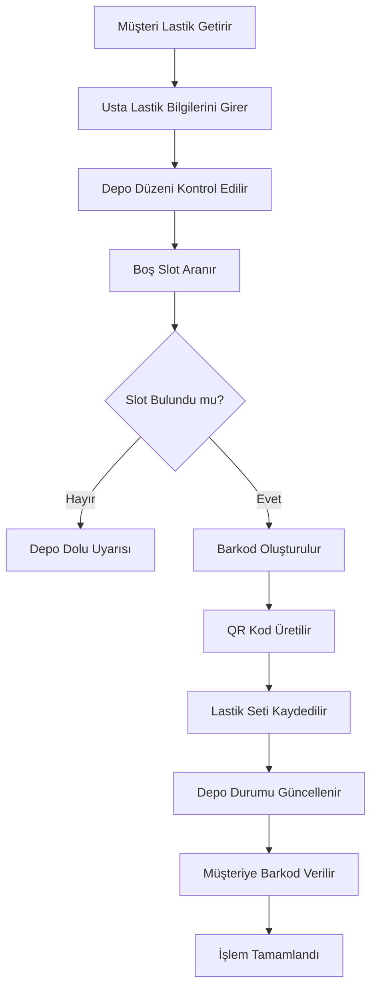
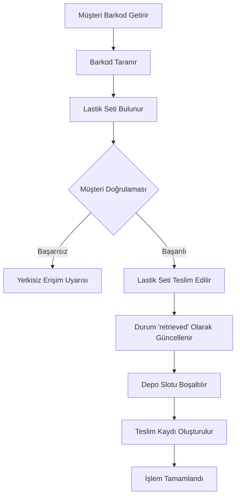
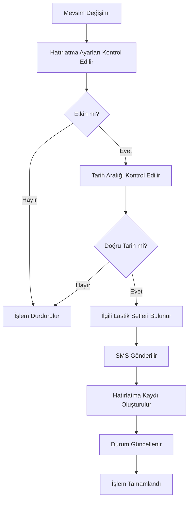

# Lastik Oteli Modülü - Detaylı Dokümantasyon

## 📋 Genel Bakış

Lastik Oteli modülü, müşterilerin yazlık ve kışlık lastiklerini güvenli bir şekilde depolamasını sağlayan kapsamlı bir sistemdir. Bu modül, lastik depolama, barkod/QR kod yönetimi, depo düzeni kontrolü ve mevsimsel hatırlatmalar gibi özellikler sunar.

## 🏗️ Mimari Yapı

### Backend Modelleri

#### 1. TireStorage Model
```typescript
interface ITireStorage {
  _id: ObjectId;
  mechanicId: ObjectId; // Usta kimliği
  customerId: ObjectId; // Müşteri kimliği
  vehicleId: ObjectId; // Araç kimliği
  
  // Lastik seti bilgileri
  tireSet: {
    season: 'summer' | 'winter';
    brand: string; // Lastik markası
    model: string; // Lastik modeli
    size: string; // Lastik boyutu (örn: 205/55R16)
    condition: 'new' | 'used' | 'good' | 'fair' | 'poor';
    treadDepth: number[]; // Diş derinliği (4 lastik için)
    productionYear?: number; // Üretim yılı
    notes?: string; // Ek notlar
  };
  
  // Depo konumu
  location: {
    corridor: string; // Koridor adı
    rack: number; // Raf numarası
    slot: number; // Slot numarası
    fullLocation: string; // Tam konum (örn: "A-1-3")
  };
  
  // Barkod ve QR kod
  barcode: string; // Benzersiz barkod
  qrCode: string; // QR kod URL'i
  
  // Depolama bilgileri
  storageFee: number; // Depolama ücreti
  depositDate: Date; // Depoya konulma tarihi
  expiryDate: Date; // Son kullanma tarihi
  
  // Durum ve takip
  status: 'stored' | 'retrieved' | 'expired';
  reminderSent: boolean; // Hatırlatma gönderildi mi?
  photos: string[]; // Lastik fotoğrafları
  
  // Metadata
  createdAt: Date;
  updatedAt: Date;
}
```

#### 2. DepotLayout Model
```typescript
interface IDepotLayout {
  _id: ObjectId;
  mechanicId: ObjectId; // Usta kimliği
  
  // Depo düzeni
  layout: {
    corridors: Array<{
      name: string; // Koridor adı (A, B, C)
      racks: number; // Raf sayısı
      slotsPerRack: number; // Raf başına slot sayısı
      totalSlots: number; // Toplam slot sayısı
    }>;
    totalCapacity: number; // Toplam kapasite
  };
  
  // Slot durumları
  slotStatus: Array<{
    location: string; // Tam konum (A-1-3)
    status: 'available' | 'occupied' | 'reserved';
    tireStorageId?: ObjectId; // Hangi lastik seti
    occupiedDate?: Date; // İşgal tarihi
  }>;
  
  // Metadata
  createdAt: Date;
  updatedAt: Date;
}
```

#### 3. SeasonalReminder Model
```typescript
interface ISeasonalReminder {
  _id: ObjectId;
  mechanicId: ObjectId; // Usta kimliği
  
  // Yazlık lastik hatırlatması
  summerReminder: {
    enabled: boolean;
    startDate: string; // Başlangıç tarihi (MM-DD format)
    endDate: string; // Bitiş tarihi (MM-DD format)
    message: string; // Hatırlatma mesajı
  };
  
  // Kışlık lastik hatırlatması
  winterReminder: {
    enabled: boolean;
    startDate: string; // Başlangıç tarihi (MM-DD format)
    endDate: string; // Bitiş tarihi (MM-DD format)
    message: string; // Hatırlatma mesajı
  };
  
  // Metadata
  createdAt: Date;
  updatedAt: Date;
}
```

## 🔧 Backend Servisleri

### TireStorageService

#### Ana Metodlar

##### 1. storeTireSet()
```typescript
static async storeTireSet(data: {
  mechanicId: string;
  customerId: string;
  vehicleId: string;
  tireSet: {
    season: 'summer' | 'winter';
    brand: string;
    model: string;
    size: string;
    condition: 'new' | 'used' | 'good' | 'fair' | 'poor';
    treadDepth: number[];
    productionYear?: number;
    notes?: string;
  };
  storageFee: number;
  photos?: string[];
})
```

**İşlevi:** Yeni lastik seti depoya yerleştirir.

**İşlem Adımları:**
1. Depo düzenini kontrol eder
2. Boş slot arar
3. Benzersiz barkod oluşturur
4. QR kod üretir
5. Lastik seti kaydını oluşturur
6. Depo durumunu günceller

**Dönüş Değeri:**
```typescript
{
  success: boolean;
  data: ITireStorage;
  message: string;
}
```

##### 2. findTireSetByBarcode()
```typescript
static async findTireSetByBarcode(barcode: string)
```

**İşlevi:** Barkod ile lastik seti bulur.

**Dönüş Değeri:**
```typescript
{
  success: boolean;
  data: ITireStorage | null;
  message: string;
}
```

##### 3. retrieveTireSet()
```typescript
static async retrieveTireSet(tireStorageId: string, customerId: string)
```

**İşlevi:** Lastik seti teslim eder.

**İşlem Adımları:**
1. Lastik seti kaydını bulur
2. Müşteri kimliğini doğrular
3. Durumu 'retrieved' olarak günceller
4. Depo slotunu boşaltır
5. Teslim kaydı oluşturur

##### 4. getDepotStatus()
```typescript
static async getDepotStatus(mechanicId: string)
```

**İşlevi:** Depo durumunu getirir.

**Dönüş Değeri:**
```typescript
{
  success: boolean;
  data: {
    layout: IDepotLayout;
    occupiedSlots: number;
    availableSlots: number;
    utilizationRate: number;
  };
}
```

##### 5. setupDepotLayout()
```typescript
static async setupDepotLayout(mechanicId: string, corridors: Array<{
  name: string;
  racks: number;
  slotsPerRack: number;
}>)
```

**İşlevi:** Depo düzenini oluşturur/günceller.

##### 6. sendSeasonalReminders()
```typescript
static async sendSeasonalReminders(mechanicId: string, season: 'summer' | 'winter')
```

**İşlevi:** Mevsimsel hatırlatmalar gönderir.

**İşlem Adımları:**
1. İlgili lastik setlerini bulur
2. Hatırlatma ayarlarını kontrol eder
3. SMS gönderir
4. Hatırlatma kaydı oluşturur

##### 7. setupSeasonalReminders()
```typescript
static async setupSeasonalReminders(mechanicId: string, settings: {
  summerReminder: {
    enabled: boolean;
    startDate: string;
    endDate: string;
    message: string;
  };
  winterReminder: {
    enabled: boolean;
    startDate: string;
    endDate: string;
    message: string;
  };
})
```

**İşlevi:** Mevsimsel hatırlatma ayarlarını oluşturur/günceller.

## 🌐 API Endpoints

### Base URL: `/api/tire-storage`

#### 1. POST `/store`
**Açıklama:** Lastik seti depoya yerleştirir.

**Request Body:**
```json
{
  "customerId": "string",
  "vehicleId": "string",
  "tireSet": {
    "season": "summer|winter",
    "brand": "string",
    "model": "string",
    "size": "string",
    "condition": "new|used|good|fair|poor",
    "treadDepth": [number, number, number, number],
    "productionYear": number,
    "notes": "string"
  },
  "storageFee": number,
  "photos": ["string"]
}
```

**Response:**
```json
{
  "success": true,
  "data": {
    "_id": "string",
    "barcode": "string",
    "qrCode": "string",
    "location": {
      "corridor": "string",
      "rack": number,
      "slot": number,
      "fullLocation": "string"
    },
    "status": "stored",
    "depositDate": "2024-01-01T00:00:00.000Z",
    "expiryDate": "2024-12-31T00:00:00.000Z"
  },
  "message": "Lastik seti başarıyla depoya yerleştirildi"
}
```

#### 2. GET `/find/:barcode`
**Açıklama:** Barkod ile lastik seti bulur.

**Parameters:**
- `barcode` (string): Lastik seti barkodu

**Response:**
```json
{
  "success": true,
  "data": {
    "_id": "string",
    "customerId": {
      "_id": "string",
      "name": "string",
      "surname": "string",
      "phone": "string"
    },
    "vehicleId": {
      "_id": "string",
      "brand": "string",
      "modelName": "string",
      "plateNumber": "string"
    },
    "tireSet": {
      "season": "summer",
      "brand": "string",
      "model": "string",
      "size": "string",
      "condition": "good"
    },
    "location": {
      "corridor": "A",
      "rack": 1,
      "slot": 3,
      "fullLocation": "A-1-3"
    },
    "status": "stored",
    "depositDate": "2024-01-01T00:00:00.000Z"
  }
}
```

#### 3. POST `/retrieve/:tireStorageId`
**Açıklama:** Lastik seti teslim eder.

**Parameters:**
- `tireStorageId` (string): Lastik depolama kimliği

**Request Body:**
```json
{
  "customerId": "string",
  "notes": "string"
}
```

**Response:**
```json
{
  "success": true,
  "data": {
    "_id": "string",
    "status": "retrieved",
    "retrievedDate": "2024-01-01T00:00:00.000Z",
    "location": {
      "status": "available"
    }
  },
  "message": "Lastik seti başarıyla teslim edildi"
}
```

#### 4. GET `/depot-status`
**Açıklama:** Depo durumunu getirir.

**Response:**
```json
{
  "success": true,
  "data": {
    "layout": {
      "corridors": [
        {
          "name": "A",
          "racks": 5,
          "slotsPerRack": 10,
          "totalSlots": 50
        }
      ],
      "totalCapacity": 50
    },
    "occupiedSlots": 15,
    "availableSlots": 35,
    "utilizationRate": 30
  }
}
```

#### 5. POST `/setup-depot`
**Açıklama:** Depo düzenini oluşturur/günceller.

**Request Body:**
```json
{
  "corridors": [
    {
      "name": "A",
      "racks": 5,
      "slotsPerRack": 10
    },
    {
      "name": "B",
      "racks": 3,
      "slotsPerRack": 8
    }
  ]
}
```

**Response:**
```json
{
  "success": true,
  "data": {
    "_id": "string",
    "layout": {
      "corridors": [...],
      "totalCapacity": 74
    },
    "slotStatus": []
  },
  "message": "Depo düzeni başarıyla oluşturuldu"
}
```

#### 6. POST `/send-seasonal-reminders`
**Açıklama:** Mevsimsel hatırlatmalar gönderir.

**Request Body:**
```json
{
  "season": "summer|winter"
}
```

**Response:**
```json
{
  "success": true,
  "data": {
    "sentCount": 15,
    "failedCount": 0,
    "reminders": [
      {
        "customerId": "string",
        "phone": "string",
        "message": "string",
        "status": "sent"
      }
    ]
  },
  "message": "Mevsimsel hatırlatmalar başarıyla gönderildi"
}
```

#### 7. POST `/setup-reminders`
**Açıklama:** Mevsimsel hatırlatma ayarlarını oluşturur/günceller.

**Request Body:**
```json
{
  "summerReminder": {
    "enabled": true,
    "startDate": "01-04",
    "endDate": "15-04",
    "message": "Değerli Müşterimiz, yazlık lastiklerinize geçme zamanı geldi. Randevu almak için tıklayınız."
  },
  "winterReminder": {
    "enabled": true,
    "startDate": "01-11",
    "endDate": "15-11",
    "message": "Değerli Müşterimiz, kışlık lastiklerinize geçme zamanı geldi. Randevu almak için tıklayınız."
  }
}
```

**Response:**
```json
{
  "success": true,
  "data": {
    "_id": "string",
    "summerReminder": {...},
    "winterReminder": {...}
  },
  "message": "Hatırlatma ayarları başarıyla kaydedildi"
}
```

## 📱 Frontend Bileşenleri

### TireHotelScreen

#### Ana Özellikler
- **Lastik Depolama:** Yeni lastik seti depoya yerleştirme
- **Barkod Tarama:** QR kod ile lastik seti bulma
- **Depo Yönetimi:** Depo durumu ve slot yönetimi
- **Teslim İşlemleri:** Lastik seti teslim etme
- **Hatırlatma Ayarları:** Mevsimsel hatırlatma konfigürasyonu

#### Ekran Bileşenleri

##### 1. Depo Durumu Kartı
```typescript
interface DepotStatusCard {
  totalSlots: number;
  occupiedSlots: number;
  availableSlots: number;
  utilizationRate: number;
}
```

##### 2. Lastik Seti Kartı
```typescript
interface TireSetCard {
  _id: string;
  customerName: string;
  vehicleInfo: string;
  tireInfo: {
    season: string;
    brand: string;
    size: string;
  };
  location: string;
  depositDate: Date;
  status: 'stored' | 'retrieved' | 'expired';
}
```

##### 3. Barkod Tarayıcı
- QR kod okuma
- Barkod ile arama
- Sonuç gösterimi

##### 4. Depo Düzeni Görünümü
- Koridor bazlı görünüm
- Slot durumu gösterimi
- Renk kodlu durum gösterimi

### TireDashboard Widget

#### Dashboard Özellikleri
- **Hızlı İstatistikler:** Depo kullanım oranı, aktif lastik sayısı
- **Son İşlemler:** Son depolanan/teslim edilen lastikler
- **Hatırlatmalar:** Bekleyen mevsimsel hatırlatmalar
- **Hızlı Erişim:** Depo durumu, yeni depolama, barkod tarama

## 🔄 İş Akışları

### 1. Lastik Depolama İş Akışı



### 2. Lastik Teslim İş Akışı



### 3. Mevsimsel Hatırlatma İş Akışı



## 🎯 Kullanım Senaryoları

### Senaryo 1: Yazlık Lastik Depolama
1. Müşteri yazlık lastiklerini getirir
2. Usta lastik bilgilerini sisteme girer
3. Sistem boş slot bulur ve lastiği yerleştirir
4. Barkod ve QR kod oluşturulur
5. Müşteriye barkod verilir

### Senaryo 2: Kışlık Lastik Teslimi
1. Müşteri barkod ile gelir
2. Barkod taranır ve lastik seti bulunur
3. Müşteri kimliği doğrulanır
4. Lastik seti teslim edilir
5. Depo slotu boşaltılır

### Senaryo 3: Mevsimsel Hatırlatma
1. Sistem otomatik olarak mevsim değişimini algılar
2. Hatırlatma ayarları kontrol edilir
3. İlgili müşterilere SMS gönderilir
4. Hatırlatma kayıtları oluşturulur

## 🔒 Güvenlik Özellikleri

### Kimlik Doğrulama
- JWT token tabanlı kimlik doğrulama
- Usta yetkilendirmesi
- Müşteri kimlik doğrulaması

### Veri Güvenliği
- Hassas bilgilerin şifrelenmesi
- API endpoint koruması
- Rate limiting

### İzleme ve Loglama
- Tüm işlemlerin loglanması
- Hata takibi
- Performans metrikleri

## 📊 Performans Optimizasyonları

### Veritabanı Optimizasyonları
- İndeksleme stratejileri
- Query optimizasyonu
- Connection pooling

### Cache Stratejileri
- Depo durumu cache'i
- Lastik seti bilgileri cache'i
- API response cache'i

### Ölçeklenebilirlik
- Horizontal scaling desteği
- Load balancing
- Microservice mimarisi

## 🧪 Test Stratejileri

### Unit Testler
- Servis metodları testleri
- Model validasyon testleri
- Utility fonksiyon testleri

### Integration Testler
- API endpoint testleri
- Veritabanı entegrasyon testleri
- Third-party servis testleri

### E2E Testler
- Kullanıcı senaryoları testleri
- Frontend-backend entegrasyon testleri
- Performans testleri

## 🚀 Deployment ve DevOps

### Environment Konfigürasyonu
- Development environment
- Staging environment
- Production environment

### CI/CD Pipeline
- Automated testing
- Code quality checks
- Automated deployment

### Monitoring ve Alerting
- Application monitoring
- Performance monitoring
- Error tracking
- Uptime monitoring

## 📈 Gelecek Geliştirmeler

### Planlanan Özellikler
- AI destekli lastik durumu analizi
- Otomatik fiyatlandırma sistemi
- Mobil uygulama entegrasyonu
- IoT sensör entegrasyonu

### Teknoloji Güncellemeleri
- GraphQL API desteği
- Real-time notifications
- Advanced analytics
- Machine learning entegrasyonu

---

*Bu dokümantasyon Lastik Oteli modülünün tüm özelliklerini ve kullanım senaryolarını kapsamaktadır. Güncellemeler için lütfen dokümantasyonu takip ediniz.*
