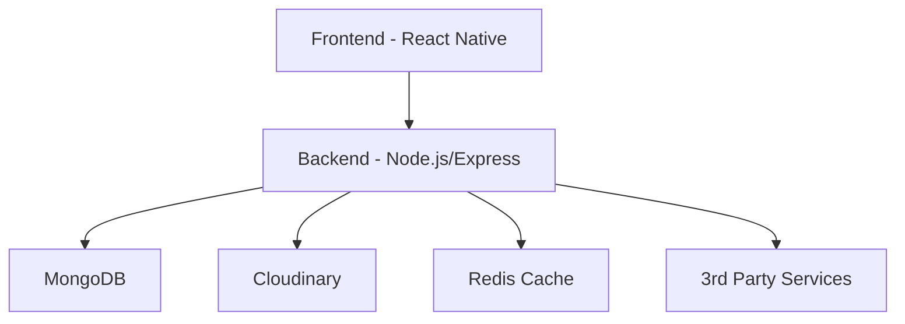
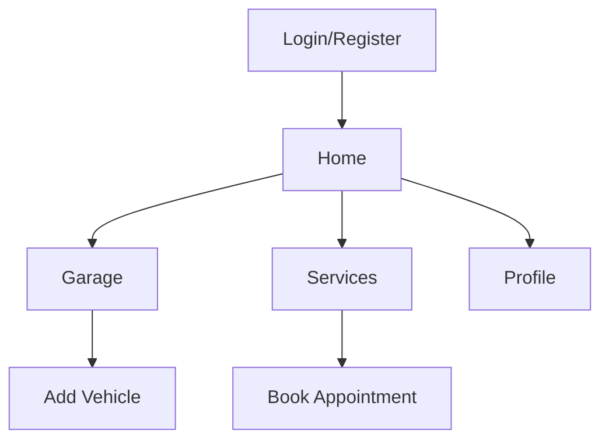

# Rektefe Platformu - Tam Kapsamlı Geliştirici Dokümantasyonu

## 1. Proje Hakkında Genel Bilgi

### 1.1 Proje Amacı ve Vizyon
Rektefe Platformu, araç sahiplerinin araçlarını yönetebileceği, bakım, sigorta, yakıt, servis ve randevu işlemlerini kolayca takip edebileceği, servis sağlayıcıların ise hizmet sunabileceği kapsamlı bir dijital ekosistemdir. Platform, araç sahiplerine dijital bir garaj ve bakım asistanı sunarken, servis sağlayıcılar için müşteri ve iş yönetimini kolaylaştırmayı hedeflemektedir.

### 1.2 Hedef Kitle ve İş Modeli
- **Araç Sahipleri:** Bireysel ve kurumsal araç sahipleri
- **Servis Sağlayıcılar:** Oto servisler, lastikçiler, sigorta şirketleri
- **İş Modeli:** Freemium + Abonelik + Komisyon bazlı gelir modeli

### 1.3 Kullanıcı Tipleri
1. **Sürücü (User)**
   - Araç ekleme ve yönetme
   - Bakım ve servis takibi
   - Randevu oluşturma
   - Bildirim alma

2. **Servis Sağlayıcı (ServiceProvider)**
   - Profil ve hizmet yönetimi
   - Randevu yönetimi
   - Müşteri takibi
   - Raporlama

## 2. Yüksek Seviyede Mimarî

### 2.1 Sistem Mimarisi


### 2.2 Teknoloji Seçimleri ve Nedenleri
- **Frontend:** React Native
  - Cross-platform geliştirme
  - Geniş ekosistem
  - Performans optimizasyonu
  - Hot reload desteği

- **Backend:** Node.js/Express
  - JavaScript/TypeScript ekosistemi
  - Asenkron işlem desteği
  - Geniş middleware desteği
  - Kolay ölçeklenebilirlik

- **Veritabanı:** MongoDB
  - Esnek şema yapısı
  - JSON benzeri döküman yapısı
  - Kolay ölçeklenebilirlik
  - Zengin sorgulama yetenekleri

## 3. Frontend (rektefe-dv)

### 3.1 Teknoloji Stack
- React Native 0.72+
- Redux Toolkit (State Management)
- React Navigation 6.x
- Axios (API Communication)
- React Native Paper (UI Components)
- Lottie (Animations)
- AsyncStorage (Local Storage)

### 3.2 Ekran Yapısı


### 3.3 Önemli Bileşenler
1. **AuthStack**
   - LoginScreen
   - RegisterScreen
   - ForgotPasswordScreen

2. **MainStack**
   - HomeScreen
   - GarageScreen
   - ServiceScreen
   - ProfileScreen

3. **ModalStack**
   - AddVehicleModal
   - BookAppointmentModal
   - SettingsModal

### 3.4 State Yönetimi
```typescript
// store/slices/authSlice.ts
interface AuthState {
  user: User | null;
  token: string | null;
  loading: boolean;
  error: string | null;
}

// store/slices/vehicleSlice.ts
interface VehicleState {
  vehicles: Vehicle[];
  selectedVehicle: Vehicle | null;
  loading: boolean;
  error: string | null;
}
```

## 4. Backend (rest-api)

### 4.1 API Yapısı
```typescript
// Örnek Route Yapısı
router.post('/vehicles', 
  authMiddleware,
  validateVehicleInput,
  async (req, res) => {
    try {
      const vehicle = await Vehicle.create({
        ...req.body,
        userId: req.user.id
      });
      res.status(201).json(vehicle);
    } catch (error) {
      next(error);
    }
  }
);
```

### 4.2 Veri Modelleri
```typescript
// models/Vehicle.ts
interface Vehicle {
  userId: ObjectId;
  brand: string;
  model: string;
  package: string;
  year: number;
  fuelType: string;
  transmission: string;
  mileage: number;
  plate: string;
  isFavorite: boolean;
  createdAt: Date;
  updatedAt: Date;
}

// models/User.ts
interface User {
  email: string;
  password: string;
  name: string;
  userType: 'user' | 'serviceProvider';
  createdAt: Date;
  updatedAt: Date;
}
```

### 4.3 Middleware Yapısı
- JWT Authentication
- Rate Limiting
- Error Handling
- Request Validation
- Logging

## 5. Güvenlik ve Performans

### 5.1 Güvenlik Önlemleri
- JWT tabanlı kimlik doğrulama
- Rate limiting
- Input validasyonu
- XSS ve CSRF koruması
- Güvenli şifreleme

### 5.2 Performans Optimizasyonları
- Redis caching
- MongoDB indeksleme
- Image optimization
- Lazy loading
- Code splitting

## 6. DevOps ve Deployment

### 6.1 CI/CD Pipeline
```yaml
name: CI/CD Pipeline
on:
  push:
    branches: [ main, develop ]
  pull_request:
    branches: [ main, develop ]

jobs:
  test:
    runs-on: ubuntu-latest
    steps:
      - uses: actions/checkout@v2
      - name: Run Tests
        run: npm test

  deploy:
    needs: test
    runs-on: ubuntu-latest
    steps:
      - name: Deploy to Production
        run: npm run deploy
```

### 6.2 Monitoring
- Sentry (Error Tracking)
- NewRelic (Performance Monitoring)
- Custom Logging System

## 7. Kurulum ve Geliştirme

### 7.1 Geliştirme Ortamı Kurulumu
```bash
# Backend
cd rest-api
npm install
cp .env.example .env
npm run dev

# Frontend
cd rektefe-dv
npm install
cp .env.example .env
npm run ios # veya npm run android
```

### 7.2 Gerekli Ortam Değişkenleri
```env
# Backend (.env)
PORT=3000
MONGODB_URI=mongodb://localhost:27017/rektefe
JWT_SECRET=your-secret-key
CLOUDINARY_URL=your-cloudinary-url

# Frontend (.env)
API_URL=http://localhost:3000
```

## 8. Katkıda Bulunma

### 8.1 Geliştirme Süreci
1. Feature branch oluştur
2. Değişiklikleri yap
3. Testleri çalıştır
4. PR oluştur
5. Code review bekle
6. Merge et

### 8.2 Kod Standartları
- ESLint ve Prettier kullanımı
- TypeScript strict mode
- Jest test coverage
- Conventional commits

## 9. Sık Sorulan Sorular

### 9.1 Genel Sorular
- **Frontend ile backend nasıl haberleşiyor?**
  - Axios ile REST API üzerinden JWT token ile.
- **Veriler nerede tutuluyor?**
  - MongoDB'de, medya dosyaları Cloudinary'de.
- **Kullanıcı ve servis sağlayıcı ayrımı nasıl?**
  - userType alanı ile.

### 9.2 Teknik Sorular
- **JWT token süresi ne kadar?**
  - Access token: 1 saat
  - Refresh token: 7 gün
- **Dosya upload limiti nedir?**
  - Maksimum 5MB
  - Desteklenen formatlar: jpg, png, pdf

## 10. Ekler

### 10.1 API Endpoint Listesi
```typescript
// Auth
POST /api/auth/register
POST /api/auth/login
POST /api/auth/refresh-token

// Vehicles
GET /api/vehicles
POST /api/vehicles
PUT /api/vehicles/:id
DELETE /api/vehicles/:id

// Appointments
GET /api/appointments
POST /api/appointments
PUT /api/appointments/:id
```

### 10.2 Örnek İstek/Yanıt Formatları
```typescript
// Örnek Başarılı Yanıt
{
  success: true,
  data: {
    // response data
  },
  message: "İşlem başarılı"
}

// Örnek Hata Yanıtı
{
  success: false,
  error: {
    code: "VALIDATION_ERROR",
    message: "Geçersiz veri formatı",
    details: []
  }
}
``` 