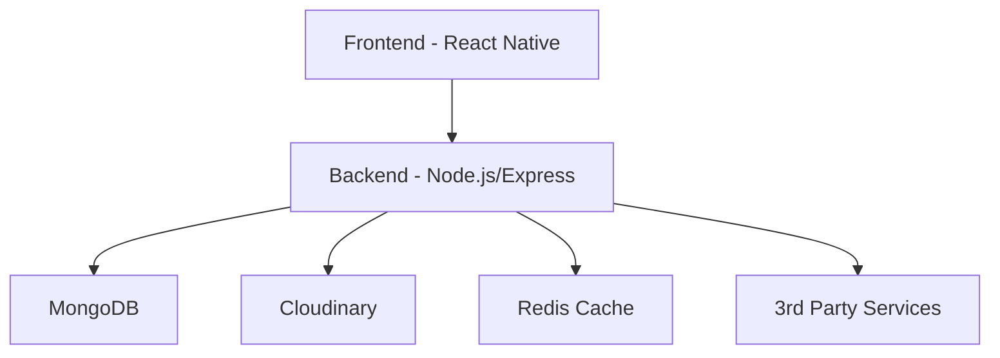
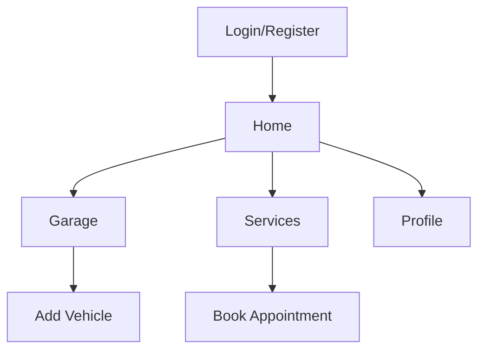
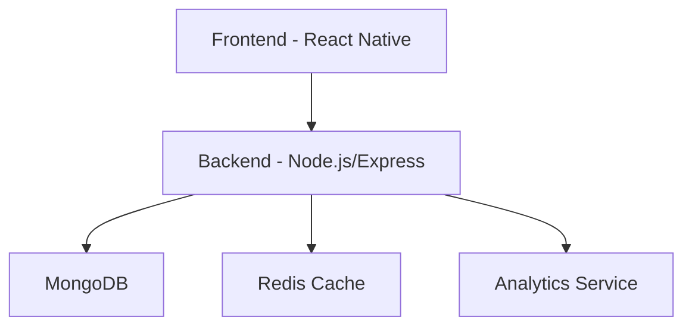
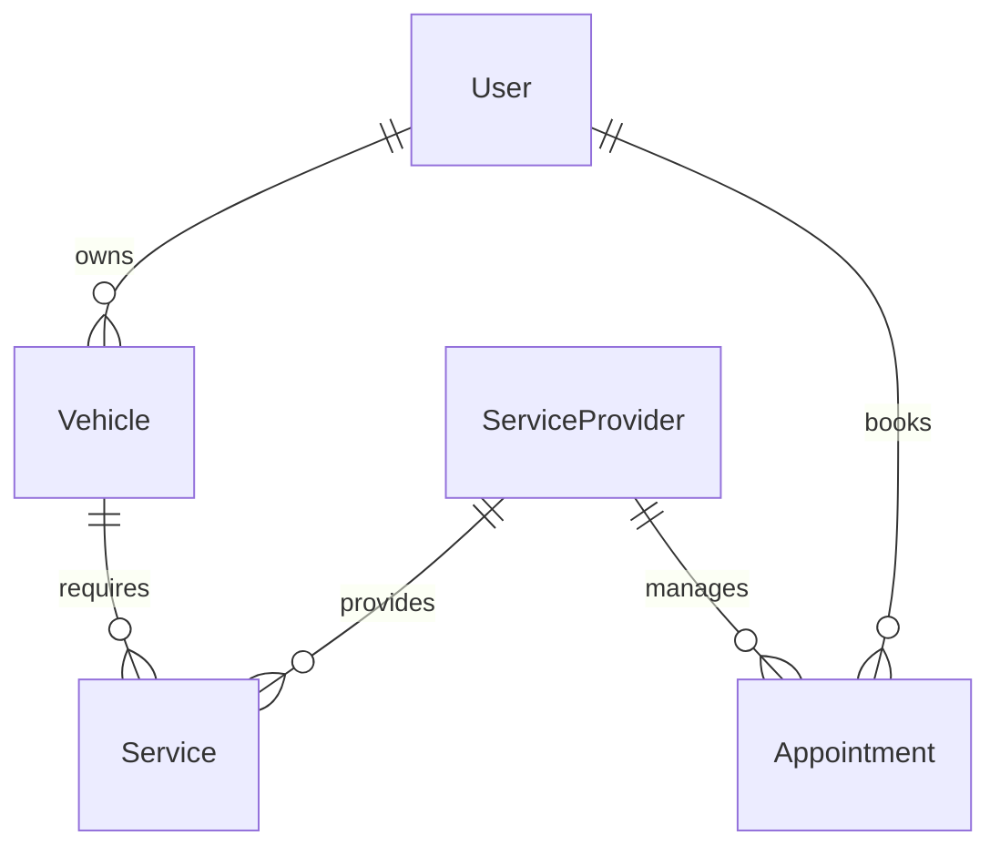

# Rektefe Platformu - Tam Kapsamlı Geliştirici Dokümantasyonu

## 1. Proje Hakkında Genel Bilgi

### 1.1 Proje Amacı ve Vizyon
Rektefe Platformu, araç sahiplerinin araçlarını yönetebileceği, bakım, sigorta, yakıt, servis ve randevu işlemlerini kolayca takip edebileceği, servis sağlayıcıların ise hizmet sunabileceği kapsamlı bir dijital ekosistemdir. Platform, araç sahiplerine dijital bir garaj ve bakım asistanı sunarken, servis sağlayıcılar için müşteri ve iş yönetimini kolaylaştırmayı hedeflemektedir.

### 1.2 Hedef Kitle ve İş Modeli
- **Araç Sahipleri:** Bireysel ve kurumsal araç sahipleri
- **Servis Sağlayıcılar:** Oto servisler, lastikçiler, sigorta şirketleri
- **İş Modeli:** Freemium + Abonelik + Komisyon bazlı gelir modeli

### 1.3 Kullanıcı Tipleri
1. **Sürücü (User)**
   - Araç ekleme ve yönetme
   - Bakım ve servis takibi
   - Randevu oluşturma
   - Bildirim alma

2. **Servis Sağlayıcı (ServiceProvider)**
   - Profil ve hizmet yönetimi
   - Randevu yönetimi
   - Müşteri takibi
   - Raporlama

## 2. Yüksek Seviyede Mimarî

### 2.1 Sistem Mimarisi


### 2.2 Teknoloji Seçimleri ve Nedenleri
- **Frontend:** React Native
  - Cross-platform geliştirme
  - Geniş ekosistem
  - Performans optimizasyonu
  - Hot reload desteği

- **Backend:** Node.js/Express
  - JavaScript/TypeScript ekosistemi
  - Asenkron işlem desteği
  - Geniş middleware desteği
  - Kolay ölçeklenebilirlik

- **Veritabanı:** MongoDB
  - Esnek şema yapısı
  - JSON benzeri döküman yapısı
  - Kolay ölçeklenebilirlik
  - Zengin sorgulama yetenekleri

## 3. Frontend (rektefe-dv)

### 3.1 Teknoloji Stack
- React Native 0.72+
- Redux Toolkit (State Management)
- React Navigation 6.x
- Axios (API Communication)
- React Native Paper (UI Components)
- Lottie (Animations)
- AsyncStorage (Local Storage)

### 3.2 Ekran Yapısı


### 3.3 Önemli Bileşenler
1. **AuthStack**
   - LoginScreen
   - RegisterScreen
   - ForgotPasswordScreen

2. **MainStack**
   - HomeScreen
   - GarageScreen
   - ServiceScreen
   - ProfileScreen

3. **ModalStack**
   - AddVehicleModal
   - BookAppointmentModal
   - SettingsModal

### 3.4 State Yönetimi
```typescript
// store/slices/authSlice.ts
interface AuthState {
  user: User | null;
  token: string | null;
  loading: boolean;
  error: string | null;
}

// store/slices/vehicleSlice.ts
interface VehicleState {
  vehicles: Vehicle[];
  selectedVehicle: Vehicle | null;
  loading: boolean;
  error: string | null;
}
```

## 4. Backend (rest-api)

### 4.1 API Yapısı ve Dokümantasyonu
```typescript
// Örnek Route Yapısı
router.post('/vehicles', 
  authMiddleware,
  validateVehicleInput,
  async (req, res) => {
    try {
      const vehicle = await Vehicle.create({
        ...req.body,
        userId: req.user.id
      });
      res.status(201).json(vehicle);
    } catch (error) {
      next(error);
    }
  }
);

// API Endpoint Listesi
// Auth
POST /api/auth/register
POST /api/auth/login
POST /api/auth/refresh-token

// Vehicles
GET /api/vehicles
POST /api/vehicles
PUT /api/vehicles/:id
DELETE /api/vehicles/:id

// Posts
GET /api/posts
POST /api/posts
POST /api/posts/:postId/like
DELETE /api/posts/:postId

// Appointments
GET /api/appointments
POST /api/appointments
PUT /api/appointments/:id

// Users
GET /api/users/:id
POST /api/users/profile-photo
POST /api/users/cover-photo

// Upload
POST /api/upload

// Örnek İstek/Yanıt Formatları
// Başarılı Yanıt
{
  success: true,
  data: {
    // response data
  },
  message: "İşlem başarılı"
}

// Hata Yanıtı
{
  success: false,
  error: {
    code: "VALIDATION_ERROR",
    message: "Geçersiz veri formatı",
    details: []
  }
}
```

### 4.2 Veri Modelleri
```typescript
// models/Vehicle.ts
interface Vehicle {
  _id: string;
  userId: string;
  brand: string;
  modelName: string;
  package: string;
  year: number;
  engineType: string;
  fuelType: 'Benzin' | 'Dizel' | 'Elektrik' | 'Benzin/Tüp' | 'Hibrit';
  transmission: string;
  mileage: number;
  plate: string;
  image?: string;
  createdAt: Date;
}

// models/User.ts
interface User {
  _id: string;
  name: string;
  surname: string;
  username?: string;
  bio?: string;
  avatar?: string;
  cover?: string;
  phone?: string;
  city?: string;
  email: string;
  password: string;
  userType: 'user' | 'serviceProvider';
  followers: string[];
  following: string[];
  notifications: Notification[];
  createdAt: Date;
}

// models/Post.ts
interface Post {
  _id: string;
  user: string; // ObjectId
  content: string;
  likes: string[];
  createdAt: Date;
}
```

### 4.3 Middleware Yapısı
- JWT Authentication
- Rate Limiting
- Error Handling
- Request Validation
- Logging

## 5. Güvenlik, Performans ve Monitoring

### 5.1 Güvenlik Önlemleri
- JWT tabanlı kimlik doğrulama
- Rate limiting ve throttling
  - IP bazlı rate limiting
  - Kullanıcı bazlı rate limiting
  - Endpoint bazlı rate limiting
  - Burst handling
  - Request throttling
  - Bandwidth throttling
  - Concurrent request limiting
  - Resource usage limiting
- Input validasyonu
- XSS ve CSRF koruması
- Güvenli şifreleme
- Role-based access control (RBAC)
- API key yönetimi
- OAuth entegrasyonu
- Session yönetimi
- Password hashing ve salting

### 5.2 Performans Optimizasyonları
- Redis caching
- MongoDB indeksleme
- Image optimization
- Lazy loading
- Code splitting
- Bundle size optimizasyonu
- Database query optimizasyonu
- Load balancing
- CDN entegrasyonu
- Service worker implementasyonu

### 5.3 Monitoring ve Logging
- **Error Tracking**
  - Sentry entegrasyonu
  - Error logging
  - Crash reporting
  - Performance monitoring

- **Logging Sistemi**
  - Request logging
  - Error logging
  - Audit logging
  - Performance logging
  - Security logging

- **Alerting**
  - Error alerts
  - Performance alerts
  - Security alerts
  - System health alerts

## 6. DevOps ve Deployment

### 6.1 CI/CD Pipeline
```yaml
name: CI/CD Pipeline
on:
  push:
    branches: [ main, develop ]
  pull_request:
    branches: [ main, develop ]

jobs:
  test:
    runs-on: ubuntu-latest
    steps:
      - uses: actions/checkout@v2
      - name: Run Tests
        run: npm test

  deploy:
    needs: test
    runs-on: ubuntu-latest
    steps:
      - name: Deploy to Production
        run: npm run deploy
```

### 6.2 Monitoring
- Sentry (Error Tracking)
- NewRelic (Performance Monitoring)
- Custom Logging System

## 7. Kurulum ve Geliştirme

### 7.1 Geliştirme Ortamı Kurulumu
```bash
# Backend
cd rest-api
npm install
cp .env.example .env
npm run dev

# Frontend
cd rektefe-dv
npm install
cp .env.example .env
npm run ios # veya npm run android
```

### 7.2 Gerekli Ortam Değişkenleri
```env
# Backend (.env)
PORT=3000
MONGODB_URI=mongodb://localhost:27017/rektefe
JWT_SECRET=your-secret-key
CLOUDINARY_URL=your-cloudinary-url

# Frontend (.env)
API_URL=http://localhost:3000
```

## 8. Katkıda Bulunma

### 8.1 Geliştirme Süreci
1. Feature branch oluştur
2. Değişiklikleri yap
3. Testleri çalıştır
4. PR oluştur
5. Code review bekle
6. Merge et

### 8.2 Kod Standartları
- ESLint ve Prettier kullanımı
- TypeScript strict mode
- Jest test coverage
- Conventional commits
- Code review süreci
- Documentation requirements
- Performance benchmarks
- Security guidelines
- Accessibility standards

## 9. Sık Sorulan Sorular

### 9.1 Genel Sorular
- **Frontend ile backend nasıl haberleşiyor?**
  - Axios ile REST API üzerinden JWT token ile.
- **Veriler nerede tutuluyor?**
  - MongoDB'de, medya dosyaları Cloudinary'de.
- **Kullanıcı ve servis sağlayıcı ayrımı nasıl?**
  - userType alanı ile.

### 9.2 Teknik Sorular
- **JWT token süresi ne kadar?**
  - Access token: 1 saat
  - Refresh token: 7 gün
- **Dosya upload limiti nedir?**
  - Maksimum 5MB
  - Desteklenen formatlar: jpg, png, pdf

## 10. Ekler

### 10.1 API Endpoint Listesi
```typescript
// Auth
POST /api/auth/register
POST /api/auth/login
POST /api/auth/refresh-token

// Vehicles
GET /api/vehicles
POST /api/vehicles
PUT /api/vehicles/:id
DELETE /api/vehicles/:id

// Posts
GET /api/posts
POST /api/posts
POST /api/posts/:postId/like
DELETE /api/posts/:postId

// Appointments
GET /api/appointments
POST /api/appointments
PUT /api/appointments/:id

// Users
GET /api/users/:id
POST /api/users/profile-photo
POST /api/users/cover-photo

// Upload
POST /api/upload
```

### 10.2 Örnek İstek/Yanıt Formatları
```typescript
// Örnek Başarılı Yanıt
{
  success: true,
  data: {
    // response data
  },
  message: "İşlem başarılı"
}

// Örnek Hata Yanıtı
{
  success: false,
  error: {
    code: "VALIDATION_ERROR",
    message: "Geçersiz veri formatı",
    details: []
  }
}
```

## 11. Servis Sağlayıcı Uygulaması (Rektefe Usta)

### 11.1 Uygulama Amacı
- Servis sağlayıcıların randevu yönetimi
- Müşteri takibi ve iletişimi
- Hizmet ve fiyat yönetimi
- Raporlama ve analitik

### 11.2 Teknik Yapı


### 11.3 Özellikler
- Randevu yönetimi
- Müşteri profili görüntüleme
- Hizmet kataloğu yönetimi
- Fiyatlandırma yönetimi
- Çalışma saatleri ayarları
- Bildirim yönetimi
- Raporlama ve analitik

## 12. Test Stratejisi

### 12.1 Frontend Testleri
- Unit testler (Jest)
- Integration testler
- E2E testler (Detox)
- Snapshot testler
- Component testleri
- Hook testleri

### 12.2 Backend Testleri
- API testleri
- Database testleri
- Load testleri
- Security testleri
- Integration testler
- Unit testler

## 13. Monitoring ve Logging

### 13.1 Error Tracking
- Sentry entegrasyonu
- Error logging
- Crash reporting
- Performance monitoring

### 13.2 Logging Sistemi
- Request logging
- Error logging
- Audit logging
- Performance logging
- Security logging

### 13.3 Alerting
- Error alerts
- Performance alerts
- Security alerts
- System health alerts

## 14. Dokümantasyon

### 14.1 Teknik Dokümantasyon
- API dokümantasyonu (Swagger/OpenAPI)
- Component dokümantasyonu
- Setup guide
- Deployment guide
- Architecture guide
- Security guide

### 14.2 Kullanıcı Dokümantasyonu
- Kullanıcı kılavuzu
- Servis sağlayıcı kılavuzu
- FAQ
- Troubleshooting guide
- Video tutorials

## 15. Veritabanı Yapısı

### 15.1 Şema İlişkileri


### 15.2 İndeksleme Stratejisi
- Kullanıcı sorguları için indeksler
- Randevu sorguları için indeksler
- Arama sorguları için indeksler
- Analitik sorguları için indeksler

## 16. API Güvenlik ve Performans

### 16.1 Rate Limiting
- IP bazlı rate limiting
- Kullanıcı bazlı rate limiting
- Endpoint bazlı rate limiting
- Burst handling

### 16.2 Throttling
- Request throttling
- Bandwidth throttling
- Concurrent request limiting
- Resource usage limiting 

## 17. Kritik Refactoring İhtiyaçları

### 17.1 Büyük Component'ler
- **RektagramScreen.tsx (1448 satır)**
  - Feed component'i ayrılmalı
  - Post listesi component'i ayrılmalı
  - Interaction handlers ayrılmalı
  - State management iyileştirilmeli

- **RektagramProfileScreen.tsx (826 satır)**
  - Profile header component'i ayrılmalı
  - Post grid component'i ayrılmalı
  - Stats component'i ayrılmalı
  - Settings component'i ayrılmalı

- **UserProfileScreen.tsx (669 satır)**
  - Profile info component'i ayrılmalı
  - Activity list component'i ayrılmalı
  - Settings component'i ayrılmalı
  - Navigation component'i ayrılmalı

- **GarageScreen.tsx (636 satır)**
  - Vehicle list component'i ayrılmalı
  - Service history component'i ayrılmalı
  - Add vehicle component'i ayrılmalı
  - Filter component'i ayrılmalı

### 17.2 Yarım Kalmış Ekranlar
- **NotificationsScreen.tsx (20 satır)**
  - Notification listesi implementasyonu
  - Push notification handling
  - Notification settings
  - Read/unread state yönetimi

- **CreatePostScreen.tsx (20 satır)**
  - Post creation form
  - Media upload
  - Location picker
  - Tag system

- **SearchScreen.tsx (20 satır)**
  - Search input
  - Filter system
  - Results list
  - Recent searches
## 18. Performans İyileştirmeleri

### 18.1 Component Optimizasyonları
```typescript
// Örnek React.memo Kullanımı
const OptimizedComponent = React.memo(({ data }) => {
  // Component logic
}, (prevProps, nextProps) => {
  // Custom comparison logic
});

// Örnek useMemo Kullanımı
const memoizedValue = useMemo(() => {
  return expensiveCalculation(data);
}, [data]);

// Örnek useCallback Kullanımı
const memoizedCallback = useCallback(() => {
  doSomething(data);
}, [data]);
```

### 18.2 State Yönetimi İyileştirmeleri
```typescript
// Redux State Normalizasyonu
interface NormalizedState {
  entities: {
    vehicles: { [id: string]: Vehicle };
    services: { [id: string]: Service };
    appointments: { [id: string]: Appointment };
  };
  ids: {
    vehicles: string[];
    services: string[];
    appointments: string[];
  };
}

// Local State Yönetimi
const [state, setState] = useState<State>(() => {
  // Lazy initialization
  return initialState;
});
```

## 19. UI/UX İyileştirmeleri

### 19.1 Tutarlılık Sorunları
- **Loading States**
  ```typescript
  // Standard Loading Component
  const LoadingSpinner = () => (
    <View style={styles.loadingContainer}>
      <ActivityIndicator size="large" color={theme.colors.primary} />
      <Text style={styles.loadingText}>Yükleniyor...</Text>
    </View>
  );
  ```

- **Error Handling**
  ```typescript
  // Standard Error Component
  const ErrorView = ({ error, onRetry }) => (
    <View style={styles.errorContainer}>
      <Text style={styles.errorText}>{error.message}</Text>
      <Button onPress={onRetry} title="Tekrar Dene" />
    </View>
  );
  ```

### 19.2 Erişilebilirlik İyileştirmeleri
```typescript
// Erişilebilir Component Örneği
const AccessibleButton = ({ onPress, label }) => (
  <TouchableOpacity
    onPress={onPress}
    accessible={true}
    accessibilityLabel={label}
    accessibilityRole="button"
    accessibilityHint="Bu butona tıklayarak işlemi gerçekleştirebilirsiniz"
  >
    <Text>{label}</Text>
  </TouchableOpacity>
);
```

## 20. Güvenlik İyileştirmeleri

### 20.1 Authentication İyileştirmeleri
```typescript
// Token Refresh Mekanizması
const refreshToken = async () => {
  try {
    const response = await api.post('/auth/refresh', {
      refreshToken: getRefreshToken()
    });
    setAccessToken(response.data.accessToken);
  } catch (error) {
    handleAuthError(error);
  }
};

// Biometric Authentication
const authenticateWithBiometrics = async () => {
  const result = await LocalAuthentication.authenticateAsync({
    promptMessage: 'Lütfen kimliğinizi doğrulayın',
    fallbackLabel: 'Şifre ile giriş yap'
  });
  return result.success;
};
```

### 20.2 Data Security
```typescript
// Secure Storage Kullanımı
const storeSecureData = async (key: string, value: string) => {
  await SecureStore.setItemAsync(key, value, {
    keychainAccessible: SecureStore.WHEN_UNLOCKED
  });
};

// Certificate Pinning
const api = axios.create({
  baseURL: API_URL,
  httpsAgent: new https.Agent({
    ca: fs.readFileSync('/path/to/certificate.pem')
  })
});
```

## 21. Servis Sağlayıcı Entegrasyonu

### 21.1 Yeni API Endpoint'leri
```typescript
// Service Provider Endpoints
interface ServiceProviderAPI {
  // Availability Management
  setAvailability: (data: AvailabilityData) => Promise<void>;
  getAvailability: () => Promise<AvailabilityData>;
  
  // Working Hours
  updateWorkingHours: (hours: WorkingHours) => Promise<void>;
  getWorkingHours: () => Promise<WorkingHours>;
  
  // Analytics
  getAnalytics: (period: string) => Promise<AnalyticsData>;
  
  // Notifications
  sendNotification: (data: NotificationData) => Promise<void>;
  getNotifications: () => Promise<Notification[]>;
}
```

### 21.2 Yeni Model'ler
```typescript
// Service Provider Models
interface ServiceProviderAvailability {
  providerId: string;
  workingHours: WorkingHours[];
  holidays: Date[];
  maxAppointmentsPerDay: number;
  breakTimes: BreakTime[];
}

interface ServiceProviderAnalytics {
  totalAppointments: number;
  completedAppointments: number;
  cancelledAppointments: number;
  averageRating: number;
  revenue: number;
  popularServices: Service[];
  customerRetention: number;
  peakHours: TimeSlot[];
}
```

## 22. Monitoring ve Logging

### 22.1 Error Tracking
```typescript
// Sentry Integration
Sentry.init({
  dsn: "your-sentry-dsn",
  enableInExpoDevelopment: true,
  debug: __DEV__,
  tracesSampleRate: 1.0,
});

// Custom Error Boundary
class ErrorBoundary extends React.Component {
  componentDidCatch(error, errorInfo) {
    Sentry.captureException(error, { extra: errorInfo });
  }
}
```

### 22.2 Performance Monitoring
```typescript
// React Performance Monitoring
const withPerformanceTracking = (WrappedComponent) => {
  return class extends React.Component {
    componentDidMount() {
      Performance.startTrace('component_mount');
    }
    
    componentDidUpdate() {
      Performance.startTrace('component_update');
    }
  };
};
```

## 23. Deployment ve CI/CD

### 23.1 Build Optimizasyonları
```yaml
# Build Configuration
build:
  optimization:
    minimize: true
    splitChunks:
      chunks: 'all'
    treeShaking: true
  assets:
    imageOptimization: true
    fontOptimization: true
```

### 23.2 Deployment Stratejisi
```yaml
# Deployment Configuration
deployment:
  strategy: blue-green
  environments:
    staging:
      url: https://staging.rektefe.com
      branch: develop
    production:
      url: https://rektefe.com
      branch: main
  rollback:
    automatic: true
    threshold: 5%
```

## 24. Öncelikli Yapılması Gerekenler

### 24.1 Acil Refactoring
1. **Component Parçalama**
   - RektagramScreen.tsx
   - RektagramProfileScreen.tsx
   - UserProfileScreen.tsx
   - GarageScreen.tsx

2. **Yarım Kalmış Ekranlar**
   - NotificationsScreen.tsx
   - CreatePostScreen.tsx
   - SearchScreen.tsx

3. **TypeScript İyileştirmeleri**
   - any kullanımının kaldırılması
   - Interface tanımlarının tamamlanması
   - Generic type kullanımının artırılması
   - Type guard'ların eklenmesi

4. **Test Coverage**
   - Unit testlerin yazılması
   - Integration testlerin eklenmesi
   - E2E testlerin yazılması
   - Snapshot testlerin eklenmesi

### 24.2 Güvenlik İyileştirmeleri
1. **Token Yönetimi**
   - Refresh token mekanizması
   - Token rotation
   - Token storage güvenliği

2. **Data Encryption**
   - Sensitive data encryption
   - Secure storage kullanımı
   - API key rotation

3. **API Security**
   - Rate limiting
   - Input validation
   - CORS policy

4. **Input Validation**
   - Form validation
   - API input validation
   - File upload validation

### 24.3 Performans İyileştirmeleri
1. **Component Optimizasyonları**
   - React.memo kullanımı
   - useMemo ve useCallback
   - Gereksiz re-render'ların önlenmesi

2. **State Management**
   - Redux state normalizasyonu
   - Local state optimizasyonu
   - Cache stratejisi

3. **Image Optimization**
   - Lazy loading
   - Image caching
   - Format optimizasyonu

4. **Network Requests**
   - Request caching
   - Batch requests
   - Error handling 

## 25. Bağımlılık ve Versiyon Yönetimi

### 25.1 Frontend Bağımlılıkları
```json
{
  "dependencies": {
    "react": "18.2.0",
    "react-native": "0.73.6",
    "expo": "^50.0.10"
  },
  "devDependencies": {
    "typescript": "^5.1.3",
    "@types/react": "~18.2.45"
  }
}
```

### 25.2 Backend Bağımlılıkları
```json
{
  "dependencies": {
    "express": "^4.18.4",
    "mongoose": "^8.15.1",
    "typescript": "^5.8.3"
  }
}
```

### 25.3 Versiyon Kontrol Stratejisi
- Semantic versioning kullanımı
- Breaking changes yönetimi
- Dependency update stratejisi
- Security patch yönetimi

## 26. Build ve Deployment Konfigürasyonları

### 26.1 Frontend Build Konfigürasyonu
```javascript
// babel.config.js
module.exports = {
  presets: ['babel-preset-expo'],
  plugins: [
    'react-native-reanimated/plugin',
    ['module-resolver', {
      root: ['./src'],
      extensions: ['.ios.js', '.android.js', '.js', '.ts', '.tsx', '.json'],
      alias: {
        '@components': './src/components',
        '@screens': './src/screens',
        '@utils': './src/utils'
      }
    }]
  ]
};
```

### 26.2 Backend Build Konfigürasyonu
```typescript
// tsconfig.json
{
  "compilerOptions": {
    "target": "es2018",
    "module": "commonjs",
    "outDir": "./dist",
    "rootDir": "./src",
    "strict": true,
    "esModuleInterop": true,
    "skipLibCheck": true,
    "forceConsistentCasingInFileNames": true
  }
}
```

## 27. Test Konfigürasyonları

### 27.1 Frontend Test Setup
```javascript
// jest.config.js
module.exports = {
  preset: 'jest-expo',
  transformIgnorePatterns: [
    'node_modules/(?!((jest-)?react-native|@react-native(-community)?)|expo(nent)?|@expo(nent)?/.*|@expo-google-fonts/.*|react-navigation|@react-navigation/.*|@unimodules/.*|unimodules|sentry-expo|native-base|react-native-svg)'
  ],
  setupFiles: ['<rootDir>/jest.setup.js'],
  collectCoverageFrom: [
    'src/**/*.{js,jsx,ts,tsx}',
    '!src/**/*.d.ts'
  ]
};
```

### 27.2 Backend Test Setup
```typescript
// jest.config.ts
export default {
  preset: 'ts-jest',
  testEnvironment: 'node',
  roots: ['<rootDir>/src'],
  testMatch: ['**/__tests__/**/*.ts', '**/?(*.)+(spec|test).ts'],
  transform: {
    '^.+\\.ts$': 'ts-jest'
  },
  coverageDirectory: 'coverage',
  collectCoverageFrom: [
    'src/**/*.ts',
    '!src/**/*.d.ts'
  ]
};
```

## 28. Error Handling ve Logging

### 28.1 Global Error Handler
```typescript
// Global error handler
class AppError extends Error {
  constructor(
    public statusCode: number,
    public message: string,
    public isOperational = true
  ) {
    super(message);
    Object.setPrototypeOf(this, AppError.prototype);
  }
}

// Error handling middleware
const errorHandler = (err: Error, req: Request, res: Response, next: NextFunction) => {
  if (err instanceof AppError) {
    return res.status(err.statusCode).json({
      status: 'error',
      message: err.message
    });
  }
  
  // Log error
  logger.error(err);
  
  return res.status(500).json({
    status: 'error',
    message: 'Internal server error'
  });
};
```

### 28.2 Logging Stratejisi
```typescript
// Winston logger configuration
const logger = winston.createLogger({
  level: 'info',
  format: winston.format.combine(
    winston.format.timestamp(),
    winston.format.json()
  ),
  transports: [
    new winston.transports.File({ filename: 'error.log', level: 'error' }),
    new winston.transports.File({ filename: 'combined.log' })
  ]
});
```

## 29. Internationalization (i18n)

### 29.1 i18n Konfigürasyonu
```typescript
// i18n configuration
import i18n from 'i18next';
import { initReactI18next } from 'react-i18next';

i18n
  .use(initReactI18next)
  .init({
    resources: {
      en: {
        translation: require('./locales/en.json')
      },
      tr: {
        translation: require('./locales/tr.json')
      }
    },
    lng: 'tr',
    fallbackLng: 'en',
    interpolation: {
      escapeValue: false
    }
  });
```

### 29.2 Dil Dosyaları
```json
// tr.json
{
  "common": {
    "loading": "Yükleniyor...",
    "error": "Hata",
    "success": "Başarılı"
  },
  "auth": {
    "login": "Giriş Yap",
    "register": "Kayıt Ol",
    "forgotPassword": "Şifremi Unuttum"
  }
}
```

## 30. Analytics ve Monitoring

### 30.1 User Tracking
```typescript
// Analytics service
class AnalyticsService {
  trackEvent(eventName: string, properties?: object) {
    // Track user events
  }

  trackScreen(screenName: string) {
    // Track screen views
  }

  trackError(error: Error) {
    // Track errors
  }
}
```

### 30.2 Performance Monitoring
```typescript
// Performance monitoring
class PerformanceMonitor {
  measureComponentRender(componentName: string) {
    const start = performance.now();
    return {
      end: () => {
        const duration = performance.now() - start;
        // Log performance metrics
      }
    };
  }
}
```

## 31. Backup ve Disaster Recovery

### 31.1 Database Backup Stratejisi
```typescript
// Backup service
class BackupService {
  async createBackup() {
    // Create database backup
  }

  async restoreBackup(backupId: string) {
    // Restore from backup
  }

  async scheduleBackup() {
    // Schedule regular backups
  }
}
```

### 31.2 Disaster Recovery Planı
```typescript
// Disaster recovery service
class DisasterRecoveryService {
  async initiateFailover() {
    // Initiate failover to backup systems
  }

  async validateBackup() {
    // Validate backup integrity
  }

  async testRecovery() {
    // Test recovery procedures
  }
}
```

## 32. API Versiyonlama ve Dokümantasyon

### 32.1 API Versiyonlama
```typescript
// API versioning middleware
const apiVersioning = (req: Request, res: Response, next: NextFunction) => {
  const version = req.headers['api-version'] || 'v1';
  req.apiVersion = version;
  next();
};

// Route versioning
router.use('/api/v1', v1Routes);
router.use('/api/v2', v2Routes);
```

### 32.2 API Dokümantasyonu
```typescript
// Swagger configuration
const swaggerOptions = {
  definition: {
    openapi: '3.0.0',
    info: {
      title: 'Rektefe API',
      version: '1.0.0',
      description: 'Rektefe Platform API Documentation'
    },
    servers: [
      {
        url: 'http://localhost:3000',
        description: 'Development server'
      }
    ]
  },
  apis: ['./src/routes/*.ts']
};
```

## 33. Security Headers ve CORS

### 33.1 Security Headers
```typescript
// Security headers middleware
const securityHeaders = (req: Request, res: Response, next: NextFunction) => {
  res.setHeader('X-Content-Type-Options', 'nosniff');
  res.setHeader('X-Frame-Options', 'DENY');
  res.setHeader('X-XSS-Protection', '1; mode=block');
  res.setHeader('Strict-Transport-Security', 'max-age=31536000; includeSubDomains');
  next();
};
```

### 33.2 CORS Konfigürasyonu
```typescript
// CORS configuration
const corsOptions = {
  origin: [
    'https://rektefe.com',
    'https://app.rektefe.com'
  ],
  methods: ['GET', 'POST', 'PUT', 'DELETE'],
  allowedHeaders: ['Content-Type', 'Authorization'],
  credentials: true,
  maxAge: 86400
};
```

## 34. Accessibility ve UI/UX

### 34.1 Accessibility Konfigürasyonu
```typescript
// Accessibility configuration
const accessibilityConfig = {
  minimumTouchSize: 44,
  colorContrast: {
    primary: '#000000',
    secondary: '#FFFFFF',
    ratio: 4.5
  },
  screenReader: {
    enabled: true,
    announcements: true
  }
};
```

### 34.2 UI/UX Standartları
```typescript
// UI/UX standards
const uiStandards = {
  spacing: {
    xs: 4,
    sm: 8,
    md: 16,
    lg: 24,
    xl: 32
  },
  typography: {
    h1: { size: 32, weight: 'bold' },
    h2: { size: 24, weight: 'bold' },
    body: { size: 16, weight: 'regular' }
  },
  colors: {
    primary: '#007AFF',
    secondary: '#5856D6',
    success: '#34C759',
    error: '#FF3B30'
  }
};
```

## 35. Öncelikli Yapılacaklar Listesi

### 35.1 Acil Yapılacaklar
1. **Güvenlik İyileştirmeleri**
   - API key rotation implementasyonu
   - Rate limiting konfigürasyonu
   - Security headers implementasyonu
   - CORS policy güncellemesi

2. **Performans İyileştirmeleri**
   - Bundle size optimizasyonu
   - Code splitting implementasyonu
   - Caching stratejisi
   - Lazy loading konfigürasyonu

3. **Test Coverage**
   - Unit test yazımı
   - Integration test implementasyonu
   - E2E test setup'ı
   - Test coverage hedefleri

4 **Dokümantasyon**
   - API dokümantasyonu
   - Component dokümantasyonu
   - Setup guide
   - Troubleshooting guide

### 35.2 Orta Vadeli Yapılacaklar
1. **Internationalization**
   - i18n implementasyonu
   - Dil dosyaları
   - RTL desteği
   - Tarih/saat formatları

2. **Analytics**
   - User tracking
   - Event tracking
   - Performance tracking
   - Error tracking

3. **Backup ve Recovery**
   - Database backup planı
   - File backup stratejisi
   - Disaster recovery planı
   - Backup testing

4. **Monitoring**
   - Health check endpoint'leri
   - Performance metrics
   - Error tracking
   - Logging stratejisi 

## 36. Native Build ve Platform Özel Gereksinimler

### 36.1 Expo'dan Native Build'e Geçiş
```bash
# Expo'dan çıkış ve native build hazırlığı
npx expo prebuild
npx expo run:ios
npx expo run:android
```

### 36.2 Platform Özel Konfigürasyonlar

#### 36.2.1 iOS Konfigürasyonu
```json
// ios/Podfile
platform :ios, '13.0'
require_relative '../node_modules/react-native/scripts/react_native_pods'
require_relative '../node_modules/@react-native-community/cli-platform-ios/native_modules'

target 'rektefe' do
  config = use_native_modules!
  use_react_native!(
    :path => config[:reactNativePath],
    :hermes_enabled => true
  )
  
  # Özel pod'lar
  pod 'Firebase/Core'
  pod 'Firebase/Analytics'
  pod 'Firebase/Messaging'
end
```

#### 36.2.2 Android Konfigürasyonu
```gradle
// android/build.gradle
buildscript {
    ext {
        buildToolsVersion = "33.0.0"
        minSdkVersion = 21
        compileSdkVersion = 33
        targetSdkVersion = 33
        ndkVersion = "23.1.7779620"
    }
    repositories {
        google()
        mavenCentral()
    }
    dependencies {
        classpath("com.android.tools.build:gradle:7.3.1")
        classpath("com.google.gms:google-services:4.3.15")
    }
}
```

### 36.3 Platform Özel Özellikler

#### 36.3.1 iOS Özel Özellikler
```typescript
// iOS özel özellikler
import { Platform } from 'react-native';

// Face ID / Touch ID
const authenticateWithBiometrics = async () => {
  if (Platform.OS === 'ios') {
    const result = await LocalAuthentication.authenticateAsync({
      promptMessage: 'Lütfen kimliğinizi doğrulayın',
      fallbackLabel: 'Şifre ile giriş yap',
      disableDeviceFallback: false
    });
    return result.success;
  }
};

// Push Notifications
const configurePushNotifications = async () => {
  if (Platform.OS === 'ios') {
    const { status } = await Notifications.requestPermissionsAsync();
    if (status !== 'granted') {
      return false;
    }
    const token = await Notifications.getExpoPushTokenAsync();
    return token;
  }
};
```

#### 36.3.2 Android Özel Özellikler
```typescript
// Android özel özellikler
import { Platform } from 'react-native';

// Background Services
const startBackgroundService = async () => {
  if (Platform.OS === 'android') {
    await BackgroundService.start({
      taskName: 'RektefeService',
      taskTitle: 'Rektefe',
      taskDesc: 'Rektefe arka plan servisi',
      taskIcon: {
        name: 'ic_launcher',
        type: 'mipmap',
      },
      color: '#ff00ff',
      linking: 'default',
      parameters: {
        delay: 1000,
      },
    });
  }
};

// Deep Linking
const configureDeepLinking = () => {
  if (Platform.OS === 'android') {
    Linking.addEventListener('url', handleDeepLink);
  }
};
```

### 36.4 Tablet Optimizasyonları

#### 36.4.1 Responsive Tasarım
```typescript
// Tablet için responsive tasarım
import { Dimensions } from 'react-native';

const isTablet = () => {
  const { width, height } = Dimensions.get('window');
  const aspectRatio = height / width;
  return aspectRatio <= 1.6;
};

const getResponsiveStyle = () => {
  return {
    container: {
      flex: 1,
      padding: isTablet() ? 24 : 16,
    },
    grid: {
      columns: isTablet() ? 3 : 2,
      spacing: isTablet() ? 16 : 8,
    },
    typography: {
      h1: {
        fontSize: isTablet() ? 32 : 24,
      },
      body: {
        fontSize: isTablet() ? 18 : 16,
      },
    },
  };
};
```

#### 36.4.2 Tablet Özel UI Bileşenleri
```typescript
// Tablet için özel bileşenler
const TabletOptimizedLayout = ({ children }) => {
  const isTablet = useIsTablet();
  
  return (
    <View style={styles.container}>
      {isTablet ? (
        <View style={styles.tabletLayout}>
          <View style={styles.sidebar}>{/* Sidebar içeriği */}</View>
          <View style={styles.mainContent}>{children}</View>
        </View>
      ) : (
        children
      )}
    </View>
  );
};
```

### 36.5 Web Optimizasyonları

#### 36.5.1 Web Özel Konfigürasyon
```typescript
// Web için özel konfigürasyon
import { Platform } from 'react-native';

const webConfig = {
  // Web özel ayarlar
  baseUrl: Platform.select({
    web: 'https://web.rektefe.com',
    default: 'https://api.rektefe.com',
  }),
  // Web özel özellikler
  features: {
    pwa: true,
    offlineSupport: true,
    pushNotifications: false,
  },
};
```

#### 36.5.2 Web Özel Bileşenler
```typescript
// Web için özel bileşenler
const WebOptimizedComponent = ({ children }) => {
  const isWeb = Platform.OS === 'web';
  
  return (
    <View style={styles.container}>
      {isWeb ? (
        <div className="web-container">
          <nav className="web-nav">{/* Web navigation */}</nav>
          <main className="web-content">{children}</main>
        </div>
      ) : (
        children
      )}
    </View>
  );
};
```

### 36.6 Store Deployment Gereksinimleri

#### 36.6.1 App Store (iOS) Gereksinimleri
```typescript
// iOS App Store hazırlıkları
const iosStoreRequirements = {
  // Gerekli izinler
  permissions: {
    camera: 'Kamera erişimi gereklidir',
    photoLibrary: 'Fotoğraf erişimi gereklidir',
    location: 'Konum erişimi gereklidir',
    notifications: 'Bildirim izni gereklidir',
  },
  // Gerekli açıklamalar
  descriptions: {
    short: 'Araç bakım ve servis yönetimi',
    long: 'Detaylı açıklama...',
    keywords: 'araç, bakım, servis, randevu',
  },
  // Gerekli ekran görüntüleri
  screenshots: {
    iphone: ['6.5"', '5.5"'],
    ipad: ['12.9"', '11"'],
  },
};
```

#### 36.6.2 Play Store (Android) Gereksinimleri
```typescript
// Android Play Store hazırlıkları
const androidStoreRequirements = {
  // Gerekli izinler
  permissions: {
    camera: 'Kamera erişimi gereklidir',
    storage: 'Depolama erişimi gereklidir',
    location: 'Konum erişimi gereklidir',
    notifications: 'Bildirim izni gereklidir',
  },
  // Gerekli açıklamalar
  descriptions: {
    short: 'Araç bakım ve servis yönetimi',
    long: 'Detaylı açıklama...',
    keywords: 'araç, bakım, servis, randevu',
  },
  // Gerekli ekran görüntüleri
  screenshots: {
    phone: ['1080x1920', '1440x2560'],
    tablet: ['1920x1200', '2560x1600'],
  },
};
```

### 36.7 Build ve Deployment Süreci

#### 36.7.1 iOS Build Süreci
```bash
# iOS build süreci
# 1. Gerekli sertifikaların hazırlanması
# 2. Provisioning profile oluşturma
# 3. Build alma
xcodebuild -workspace ios/rektefe.xcworkspace -scheme rektefe -configuration Release

# 4. Archive oluşturma
xcodebuild -workspace ios/rektefe.xcworkspace -scheme rektefe -configuration Release archive -archivePath build/rektefe.xcarchive

# 5. IPA oluşturma
xcodebuild -exportArchive -archivePath build/rektefe.xcarchive -exportOptionsPlist exportOptions.plist -exportPath build
```

#### 36.7.2 Android Build Süreci
```bash
# Android build süreci
# 1. Keystore oluşturma
keytool -genkey -v -keystore rektefe.keystore -alias rektefe -keyalg RSA -keysize 2048 -validity 10000

# 2. Release build alma
cd android
./gradlew assembleRelease

# 3. Bundle oluşturma
./gradlew bundleRelease
```

### 36.8 Platform Özel Test Gereksinimleri

#### 36.8.1 iOS Test Gereksinimleri
```typescript
// iOS test gereksinimleri
const iosTestRequirements = {
  // Test cihazları
  devices: [
    'iPhone 14 Pro Max',
    'iPhone 14',
    'iPhone SE',
    'iPad Pro 12.9"',
    'iPad Air',
  ],
  // Test senaryoları
  scenarios: [
    'Face ID / Touch ID',
    'Push Notifications',
    'Deep Linking',
    'Background Fetch',
    'Universal Links',
  ],
  // Test ortamları
  environments: [
    'Development',
    'Staging',
    'Production',
  ],
};
```

#### 36.8.2 Android Test Gereksinimleri
```typescript
// Android test gereksinimleri
const androidTestRequirements = {
  // Test cihazları
  devices: [
    'Pixel 7 Pro',
    'Pixel 7',
    'Samsung Galaxy S23',
    'Samsung Galaxy Tab S8',
  ],
  // Test senaryoları
  scenarios: [
    'Biometric Authentication',
    'Push Notifications',
    'Deep Linking',
    'Background Services',
    'App Links',
  ],
  // Test ortamları
  environments: [
    'Development',
    'Staging',
    'Production',
  ],
};
```

### 36.9 Öncelikli Yapılacaklar

#### 36.9.1 Acil Yapılacaklar
1. **Expo'dan Çıkış**
   - Native modüllerin eklenmesi
   - Platform özel konfigürasyonların yapılması
   - Build süreçlerinin kurulması

2. **Platform Özel Özellikler**
   - iOS özel özelliklerin implementasyonu
   - Android özel özelliklerin implementasyonu
   - Tablet optimizasyonlarının yapılması

3. **Store Hazırlıkları**
   - App Store hazırlıkları
   - Play Store hazırlıkları
   - Gerekli dokümanların hazırlanması

4. **Test Süreçleri**
   - Platform özel test senaryolarının hazırlanması
   - Test cihazlarının temin edilmesi
   - Test süreçlerinin otomatize edilmesi

#### 36.9.2 Orta Vadeli Yapılacaklar
1. **Performans İyileştirmeleri**
   - Platform özel optimizasyonlar
   - Bundle size optimizasyonu
   - Startup time iyileştirmesi

2. **Kullanıcı Deneyimi**
   - Platform özel UI/UX iyileştirmeleri
   - Tablet optimizasyonları
   - Web optimizasyonları

3. **Güvenlik**
   - Platform özel güvenlik önlemleri
   - Store güvenlik gereksinimleri
   - Güvenlik testleri

4. **Monitoring**
   - Platform özel crash reporting
   - Performance monitoring
   - User analytics
   - Health check endpoint'leri
   - Performance metrics
   - Error tracking
   - Logging stratejisi 

## 37. Servis Sağlayıcı ve Kullanıcı Etkileşim Sistemi

### 37.1 Servis Sağlayıcı (Usta) Yönetimi
```typescript
// Servis sağlayıcı modeli
interface ServiceProvider {
  id: string;
  userId: string;
  businessName: string;
  businessType: 'MECHANIC' | 'BODY_SHOP' | 'TIRE_SHOP' | 'CAR_WASH' | 'PARTS_SHOP';
  specialties: string[];
  location: {
    address: string;
    coordinates: {
      latitude: number;
      longitude: number;
    };
    serviceArea: number; // km cinsinden hizmet alanı
  };
  workingHours: {
    day: string;
    open: string;
    close: string;
    isOpen: boolean;
  }[];
  availability: {
    isAvailable: boolean;
    nextAvailableSlot: Date;
    maxDailyAppointments: number;
  };
  rating: {
    average: number;
    totalReviews: number;
    categories: {
      service: number;
      price: number;
      punctuality: number;
      professionalism: number;
    };
  };
  services: {
    id: string;
    name: string;
    price: number;
    duration: number; // dakika
    description: string;
  }[];
  promotions: {
    id: string;
    title: string;
    description: string;
    discount: number;
    startDate: Date;
    endDate: Date;
    conditions: string[];
  }[];
  documents: {
    type: 'LICENSE' | 'CERTIFICATE' | 'INSURANCE';
    url: string;
    expiryDate: Date;
  }[];
  paymentMethods: {
    type: 'CASH' | 'CREDIT_CARD' | 'QR';
    details: any;
  }[];
}
```

### 37.2 Randevu Sistemi
```typescript
// Randevu modeli
interface Appointment {
  id: string;
  userId: string;
  serviceProviderId: string;
  vehicleId: string;
  serviceId: string;
  status: 'PENDING' | 'CONFIRMED' | 'IN_PROGRESS' | 'COMPLETED' | 'CANCELLED';
  date: Date;
  timeSlot: {
    start: Date;
    end: Date;
  };
  price: number;
  payment: {
    status: 'PENDING' | 'COMPLETED' | 'REFUNDED';
    method: 'CASH' | 'CREDIT_CARD' | 'QR';
    amount: number;
    tefePoints: number;
    qrCode: string;
  };
  review?: {
    rating: number;
    comment: string;
    categories: {
      service: number;
      price: number;
      punctuality: number;
      professionalism: number;
    };
  };
}
```

### 37.3 TEFE Puan Sistemi
```typescript
// TEFE puan sistemi
interface TefePointSystem {
  // Puan kazanma kuralları
  earningRules: {
    serviceType: string;
    points: number;
    conditions: string[];
  }[];
  
  // Puan kullanım kuralları
  redemptionRules: {
    serviceType: string;
    requiredPoints: number;
    discount: number;
    validity: number; // gün
  }[];
  
  // Kullanıcı puan durumu
  userPoints: {
    userId: string;
    totalEarned: number;
    totalSpent: number;
    currentBalance: number;
    history: {
      type: 'EARN' | 'SPEND';
      amount: number;
      serviceId: string;
      date: Date;
    }[];
  };
}
```

### 37.4 Araç Durum Takip Sistemi
```typescript
// Araç durum takip sistemi
interface VehicleStatus {
  vehicleId: string;
  lastService: {
    date: Date;
    type: string;
    serviceProviderId: string;
    nextServiceDue: Date;
  };
  components: {
    engine: {
      status: 'EXCELLENT' | 'GOOD' | 'FAIR' | 'POOR' | 'CRITICAL';
      lastCheck: Date;
      nextCheck: Date;
      recommendations: string[];
    };
    tires: {
      status: 'EXCELLENT' | 'GOOD' | 'FAIR' | 'POOR' | 'CRITICAL';
      lastCheck: Date;
      nextCheck: Date;
      recommendations: string[];
    };
    // Diğer bileşenler...
  };
  maintenanceHistory: {
    date: Date;
    type: string;
    serviceProviderId: string;
    cost: number;
    description: string;
    documents: string[]; // Fotoğraf, video, ses dosyaları
  }[];
}
```

### 37.5 Yedek Parça Sistemi
```typescript
// Yedek parça sistemi
interface SparePart {
  id: string;
  name: string;
  brand: string;
  model: string;
  compatibleVehicles: {
    make: string;
    model: string;
    year: string;
    engineType: string;
  }[];
  specifications: {
    [key: string]: string;
  };
  suppliers: {
    id: string;
    name: string;
    location: {
      address: string;
      coordinates: {
        latitude: number;
        longitude: number;
      };
    };
    stock: number;
    price: number;
    deliveryOptions: {
      type: 'PICKUP' | 'SHIPPING' | 'BOTH';
      shippingCost?: number;
      estimatedDeliveryTime?: string;
    };
  }[];
}
```

### 37.6 Çekici Hizmeti
```typescript
// Çekici hizmeti
interface TowService {
  id: string;
  userId: string;
  vehicleId: string;
  status: 'PENDING' | 'ACCEPTED' | 'IN_PROGRESS' | 'COMPLETED' | 'CANCELLED';
  type: 'EMERGENCY' | 'SCHEDULED';
  location: {
    pickup: {
      address: string;
      coordinates: {
        latitude: number;
        longitude: number;
      };
    };
    destination: {
      address: string;
      coordinates: {
        latitude: number;
        longitude: number;
      };
    };
  };
  serviceProvider?: {
    id: string;
    name: string;
    estimatedArrival: Date;
    contact: {
      phone: string;
      name: string;
    };
  };
  price: number;
  payment: {
    status: 'PENDING' | 'COMPLETED';
    method: 'CASH' | 'CREDIT_CARD' | 'QR';
    amount: number;
  };
}
```

### 37.7 Kampanya ve Bildirim Sistemi
```typescript
// Kampanya ve bildirim sistemi
interface Campaign {
  id: string;
  type: 'DISCOUNT' | 'POINTS' | 'FREE_SERVICE';
  title: string;
  description: string;
  conditions: string[];
  startDate: Date;
  endDate: Date;
  targetAudience: {
    userTypes: string[];
    locations: string[];
    vehicleTypes: string[];
  };
  rewards: {
    type: string;
    value: number;
    maxUses: number;
  };
}

interface Notification {
  id: string;
  userId: string;
  type: 'CAMPAIGN' | 'APPOINTMENT' | 'SERVICE' | 'SYSTEM';
  title: string;
  message: string;
  data: any;
  priority: 'HIGH' | 'MEDIUM' | 'LOW';
  status: 'UNREAD' | 'READ';
  createdAt: Date;
}
```

### 37.8 Yeni API Endpoint'leri

#### 37.8.1 Servis Sağlayıcı Endpoint'leri
```typescript
// Servis sağlayıcı endpoint'leri
const serviceProviderEndpoints = {
  // Profil yönetimi
  'GET /api/service-providers': 'Tüm servis sağlayıcıları listele',
  'GET /api/service-providers/:id': 'Servis sağlayıcı detaylarını getir',
  'POST /api/service-providers': 'Yeni servis sağlayıcı oluştur',
  'PUT /api/service-providers/:id': 'Servis sağlayıcı bilgilerini güncelle',
  
  // Müsaitlik yönetimi
  'GET /api/service-providers/:id/availability': 'Müsaitlik durumunu getir',
  'PUT /api/service-providers/:id/availability': 'Müsaitlik durumunu güncelle',
  
  // Hizmet yönetimi
  'GET /api/service-providers/:id/services': 'Hizmetleri listele',
  'POST /api/service-providers/:id/services': 'Yeni hizmet ekle',
  'PUT /api/service-providers/:id/services/:serviceId': 'Hizmet güncelle',
  
  // Kampanya yönetimi
  'GET /api/service-providers/:id/promotions': 'Kampanyaları listele',
  'POST /api/service-providers/:id/promotions': 'Yeni kampanya ekle',
  'PUT /api/service-providers/:id/promotions/:promotionId': 'Kampanya güncelle',
};
```

#### 37.8.2 Randevu Endpoint'leri
```typescript
// Randevu endpoint'leri
const appointmentEndpoints = {
  // Randevu yönetimi
  'GET /api/appointments': 'Randevuları listele',
  'GET /api/appointments/:id': 'Randevu detaylarını getir',
  'POST /api/appointments': 'Yeni randevu oluştur',
  'PUT /api/appointments/:id': 'Randevu güncelle',
  'DELETE /api/appointments/:id': 'Randevu iptal et',
  
  // Ödeme işlemleri
  'POST /api/appointments/:id/payment': 'Ödeme yap',
  'GET /api/appointments/:id/payment/qr': 'Ödeme QR kodu oluştur',
  
  // Değerlendirme
  'POST /api/appointments/:id/review': 'Değerlendirme yap',
  'GET /api/appointments/:id/review': 'Değerlendirme detaylarını getir',
};
```

#### 37.8.3 Yedek Parça Endpoint'leri
```typescript
// Yedek parça endpoint'leri
const sparePartEndpoints = {
  // Parça arama
  'GET /api/spare-parts': 'Parçaları listele',
  'GET /api/spare-parts/search': 'Parça ara',
  'GET /api/spare-parts/:id': 'Parça detaylarını getir',
  
  // Uyumluluk kontrolü
  'POST /api/spare-parts/compatibility': 'Araç uyumluluğunu kontrol et',
  
  // Tedarikçi işlemleri
  'GET /api/spare-parts/:id/suppliers': 'Tedarikçileri listele',
  'POST /api/spare-parts/:id/order': 'Parça siparişi oluştur',
};
```

#### 37.8.4 Çekici Hizmeti Endpoint'leri
```typescript
// Çekici hizmeti endpoint'leri
const towServiceEndpoints = {
  // Çekici talebi
  'POST /api/tow-services': 'Çekici talebi oluştur',
  'GET /api/tow-services/:id': 'Talep detaylarını getir',
  'PUT /api/tow-services/:id': 'Talep durumunu güncelle',
  
  // Konum takibi
  'GET /api/tow-services/:id/location': 'Çekici konumunu getir',
  'PUT /api/tow-services/:id/location': 'Konum güncelle',
  
  // Ödeme işlemleri
  'POST /api/tow-services/:id/payment': 'Ödeme yap',
};
```

### 37.9 Öncelikli Yapılacaklar

#### 37.9.1 Acil Yapılacaklar
1. **Servis Sağlayıcı Sistemi**
   - Profil yönetimi
   - Müsaitlik takibi
   - Hizmet kataloğu
   - Kampanya yönetimi

2. **Randevu Sistemi**
   - Randevu oluşturma
   - Ödeme entegrasyonu
   - QR kod sistemi
   - Değerlendirme sistemi

3. **TEFE Puan Sistemi**
   - Puan kazanma kuralları
   - Puan kullanım kuralları
   - Puan geçmişi
   - Ödül kataloğu

4. **Araç Durum Takibi**
   - Bileşen durumları
   - Bakım geçmişi
   - Öneriler sistemi
   - Belge yönetimi

#### 37.9.2 Orta Vadeli Yapılacaklar
1. **Yedek Parça Sistemi**
   - Parça kataloğu
   - Uyumluluk kontrolü
   - Tedarikçi entegrasyonu
   - Sipariş yönetimi

2. **Çekici Hizmeti**
   - Acil çağrı sistemi
   - Konum takibi
   - Ödeme entegrasyonu
   - Değerlendirme sistemi

3. **Kampanya ve Bildirim**
   - Kampanya yönetimi
   - Bildirim sistemi
   - Hedefleme
   - Analitik

4. **Entegrasyonlar**
   - Ödeme sistemleri
   - Harita servisleri
   - SMS/Email servisleri
   - Push notification 

## 38. Gelecek Özellikler ve Yol Haritası

### 38.1 Yapay Zeka ve Öneri Sistemi
```typescript
// AI tabanlı öneri sistemi
interface AIRecommendationSystem {
  // Araç bakım önerileri
  maintenanceRecommendations: {
    basedOnMileage: {
      serviceType: string;
      recommendedInterval: number;
      estimatedCost: number;
      priority: 'HIGH' | 'MEDIUM' | 'LOW';
    }[];
    basedOnCondition: {
      component: string;
      condition: string;
      recommendedAction: string;
      estimatedCost: number;
      urgency: 'IMMEDIATE' | 'SOON' | 'PLANNED';
    }[];
  };
  
  // Usta eşleştirme
  mechanicMatching: {
    basedOnSpecialty: {
      problemType: string;
      recommendedProviders: string[];
      matchScore: number;
      estimatedPrice: number;
    }[];
    basedOnHistory: {
      previousProviders: string[];
      successRate: number;
      averageRating: number;
    }[];
  };
  
  // Fiyat tahminleme
  pricePrediction: {
    serviceType: string;
    estimatedPrice: {
      min: number;
      max: number;
      average: number;
    };
    factors: {
      location: number;
      vehicleType: number;
      season: number;
      demand: number;
    };
  };
}
```

### 38.2 Topluluk ve Sosyal Özellikler
```typescript
// Topluluk özellikleri
interface CommunityFeatures {
  // Forum ve tartışma
  forums: {
    category: string;
    topics: {
      title: string;
      content: string;
      author: string;
      replies: number;
      views: number;
      tags: string[];
    }[];
  };
  
  // Deneyim paylaşımı
  experiences: {
    serviceProvider: string;
    serviceType: string;
    rating: number;
    review: string;
    photos: string[];
    helpful: number;
  }[];
  
  // Uzman tavsiyeleri
  expertAdvice: {
    expert: {
      name: string;
      specialty: string;
      experience: number;
      certification: string[];
    };
    advice: {
      topic: string;
      content: string;
      date: Date;
      likes: number;
    }[];
  };
}
```

### 38.3 Gelişmiş Raporlama ve Analitik
```typescript
// Gelişmiş raporlama sistemi
interface AdvancedAnalytics {
  // Kullanıcı analitikleri
  userAnalytics: {
    behavior: {
      mostUsedFeatures: string[];
      averageSessionDuration: number;
      retentionRate: number;
      churnRisk: number;
    };
    spending: {
      totalSpent: number;
      averageTransaction: number;
      preferredServices: string[];
      paymentMethods: string[];
    };
  };
  
  // Servis sağlayıcı analitikleri
  providerAnalytics: {
    performance: {
      totalAppointments: number;
      completionRate: number;
      averageRating: number;
      revenue: number;
    };
    customerInsights: {
      customerRetention: number;
      newCustomers: number;
      popularServices: string[];
      peakHours: string[];
    };
  };
  
  // Pazar analitikleri
  marketAnalytics: {
    trends: {
      popularServices: string[];
      priceTrends: number[];
      seasonalDemand: number[];
    };
    competition: {
      marketShare: number;
      competitorAnalysis: {
        name: string;
        strengths: string[];
        weaknesses: string[];
      }[];
    };
  };
}
```

### 38.4 Gelişmiş Güvenlik ve Doğrulama
```typescript
// Gelişmiş güvenlik sistemi
interface AdvancedSecurity {
  // Kullanıcı doğrulama
  userVerification: {
    identity: {
      documentType: string;
      documentNumber: string;
      verificationStatus: 'PENDING' | 'VERIFIED' | 'REJECTED';
    };
    vehicle: {
      ownership: {
        documentType: string;
        documentNumber: string;
        verificationStatus: 'PENDING' | 'VERIFIED' | 'REJECTED';
      };
      history: {
        previousOwners: number;
        accidentHistory: boolean;
        maintenanceRecords: boolean;
      };
    };
  };
  
  // Servis sağlayıcı doğrulama
  providerVerification: {
    business: {
      registration: {
        documentType: string;
        documentNumber: string;
        verificationStatus: 'PENDING' | 'VERIFIED' | 'REJECTED';
      };
      insurance: {
        policyNumber: string;
        coverage: number;
        expiryDate: Date;
      };
    };
    staff: {
      certification: {
        type: string;
        number: string;
        expiryDate: Date;
      }[];
      backgroundCheck: {
        status: 'PENDING' | 'CLEAR' | 'FLAGGED';
        date: Date;
      };
    };
  };
}
```

### 38.5 Gelişmiş Entegrasyonlar
```typescript
// Gelişmiş entegrasyonlar
interface AdvancedIntegrations {
  // Sigorta entegrasyonu
  insurance: {
    providers: {
      name: string;
      policies: {
        type: string;
        coverage: number;
        premium: number;
      }[];
    }[];
    claims: {
      status: 'PENDING' | 'APPROVED' | 'REJECTED';
      amount: number;
      documents: string[];
    }[];
  };
  
  // Araç üreticisi entegrasyonu
  manufacturer: {
    warranty: {
      status: 'ACTIVE' | 'EXPIRED';
      coverage: string[];
      expiryDate: Date;
    };
    recalls: {
      id: string;
      description: string;
      affectedComponents: string[];
      fixAvailable: boolean;
    }[];
  };
  
  // Finansal entegrasyonlar
  financial: {
    paymentProviders: {
      name: string;
      supportedMethods: string[];
      processingFees: number;
    }[];
    financing: {
      providers: {
        name: string;
        interestRate: number;
        term: number;
      }[];
      applications: {
        status: 'PENDING' | 'APPROVED' | 'REJECTED';
        amount: number;
        term: number;
      }[];
    };
  };
}
```

### 38.6 Yol Haritası

#### 38.6.1 Faz 1: Temel Özellikler (1-3 Ay)
1. **Kullanıcı Yönetimi**
   - Kayıt ve giriş sistemi
   - Profil yönetimi
   - Araç ekleme ve yönetimi

2. **Servis Sağlayıcı Entegrasyonu**
   - Usta/dükkan profilleri
   - Hizmet kataloğu
   - Randevu sistemi

3. **Temel Ödeme Sistemi**
   - QR kod entegrasyonu
   - TEFE puan sistemi
   - Ödeme geçmişi

#### 38.6.2 Faz 2: Gelişmiş Özellikler (4-6 Ay)
1. **Yapay Zeka Entegrasyonu**
   - Bakım önerileri
   - Usta eşleştirme
   - Fiyat tahminleme

2. **Topluluk Özellikleri**
   - Forum sistemi
   - Deneyim paylaşımı
   - Uzman tavsiyeleri

3. **Gelişmiş Raporlama**
   - Kullanıcı analitikleri
   - Servis sağlayıcı analitikleri
   - Pazar analitikleri

#### 38.6.3 Faz 3: İleri Özellikler (7-9 Ay)
1. **Gelişmiş Güvenlik**
   - Kullanıcı doğrulama
   - Servis sağlayıcı doğrulama
   - Belge yönetimi

2. **Entegrasyonlar**
   - Sigorta entegrasyonu
   - Araç üreticisi entegrasyonu
   - Finansal entegrasyonlar

3. **Mobil Özellikler**
   - Offline çalışma
   - Push bildirimler
   - Konum bazlı servisler

#### 38.6.4 Faz 4: Optimizasyon ve Ölçeklendirme (10-12 Ay)
1. **Performans İyileştirmeleri**
   - Platform özel optimizasyonlar
   - Bundle size optimizasyonu
   - Startup time iyileştirmesi

2. **Kullanıcı Deneyimi**
   - Platform özel UI/UX iyileştirmeleri
   - Tablet optimizasyonları
   - Web optimizasyonları

3. **Güvenlik**
   - Platform özel güvenlik önlemleri
   - Store güvenlik gereksinimleri
   - Güvenlik testleri

4. **Monitoring**
   - Platform özel crash reporting
   - Performance monitoring
   - User analytics
   - Health check endpoint'leri
   - Performance metrics
   - Error tracking
   - Logging stratejisi 

### 38.7 Başarı Metrikleri

#### 38.7.1 Kullanıcı Metrikleri
```typescript
// Kullanıcı başarı metrikleri
interface UserMetrics {
  // Kullanıcı büyüme
  growth: {
    newUsers: number;
    activeUsers: number;
    retentionRate: number;
  };
  
  // Kullanıcı etkileşimi
  engagement: {
    averageSessionDuration: number;
    featuresUsed: string[];
    returnRate: number;
  };
  
  // Kullanıcı memnuniyeti
  satisfaction: {
    averageRating: number;
    complaintRate: number;
    recommendationScore: number;
  };
}
```

#### 38.7.2 İş Metrikleri
```typescript
// İş başarı metrikleri
interface BusinessMetrics {
  // Gelir metrikleri
  revenue: {
    totalRevenue: number;
    averageTransaction: number;
    revenueGrowth: number;
  };
  
  // Operasyonel metrikler
  operations: {
    serviceCompletionRate: number;
    averageResponseTime: number;
    errorRate: number;
  };
  
  // Pazar metrikleri
  market: {
    marketShare: number;
    competitorComparison: number;
    brandRecognition: number;
  };
}
```

### 38.8 Risk Yönetimi

#### 38.8.1 Teknik Riskler
```typescript
// Teknik risk yönetimi
interface TechnicalRisks {
  // Sistem riskleri
  system: {
    scalability: {
      risk: string;
      impact: 'HIGH' | 'MEDIUM' | 'LOW';
      mitigation: string;
    };
    security: {
      risk: string;
      impact: 'HIGH' | 'MEDIUM' | 'LOW';
      mitigation: string;
    };
    performance: {
      risk: string;
      impact: 'HIGH' | 'MEDIUM' | 'LOW';
      mitigation: string;
    };
  };
  
  // Entegrasyon riskleri
  integration: {
    thirdParty: {
      risk: string;
      impact: 'HIGH' | 'MEDIUM' | 'LOW';
      mitigation: string;
    };
    data: {
      risk: string;
      impact: 'HIGH' | 'MEDIUM' | 'LOW';
      mitigation: string;
    };
  };
}
```

#### 38.8.2 İş Riskleri
```typescript
// İş risk yönetimi
interface BusinessRisks {
  // Pazar riskleri
  market: {
    competition: {
      risk: string;
      impact: 'HIGH' | 'MEDIUM' | 'LOW';
      mitigation: string;
    };
    adoption: {
      risk: string;
      impact: 'HIGH' | 'MEDIUM' | 'LOW';
      mitigation: string;
    };
  };
  
  // Operasyonel riskler
  operational: {
    serviceQuality: {
      risk: string;
      impact: 'HIGH' | 'MEDIUM' | 'LOW';
      mitigation: string;
    };
    compliance: {
      risk: string;
      impact: 'HIGH' | 'MEDIUM' | 'LOW';
      mitigation: string;
    };
  };
}
``` 

## 39. REKAİ - Yapay Zeka Asistanı

### 39.1 REKAİ Mimarisi
```typescript
// REKAİ sistem mimarisi
interface RekaiArchitecture {
  // Çekirdek bileşenler
  core: {
    // Doğal dil işleme
    nlp: {
      model: 'GPT-4' | 'Claude' | 'Custom';
      language: 'tr' | 'en';
      contextWindow: number;
      temperature: number;
    };
    
    // Bilgi tabanı
    knowledgeBase: {
      automotive: {
        brands: string[];
        models: string[];
        parts: string[];
        commonIssues: string[];
        maintenance: string[];
      };
      technical: {
        repairGuides: string[];
        diagnosticProcedures: string[];
        serviceManuals: string[];
      };
      userData: {
        vehicleHistory: string[];
        serviceHistory: string[];
        preferences: string[];
      };
    };
    
    // Öğrenme sistemi
    learning: {
      feedbackLoop: {
        userRatings: number[];
        correctionHistory: string[];
        improvementMetrics: number[];
      };
      dataCollection: {
        userInteractions: string[];
        successfulResolutions: string[];
        commonPatterns: string[];
      };
    };
  };
  
  // Özellikler
  features: {
    // Sohbet ve iletişim
    chat: {
      contextAwareness: boolean;
      multiTurnConversation: boolean;
      emotionRecognition: boolean;
      personalityTraits: string[];
    };
    
    // Problem çözme
    problemSolving: {
      diagnosticCapabilities: string[];
      solutionGeneration: string[];
      stepByStepGuides: string[];
      visualAids: string[];
    };
    
    // Öneriler
    recommendations: {
      maintenance: string[];
      upgrades: string[];
      costSaving: string[];
      safety: string[];
    };
  };
}
```

### 39.2 REKAİ Öğrenme ve Gelişim Stratejisi
```typescript
// REKAİ öğrenme stratejisi
interface RekaiLearningStrategy {
  // Veri toplama
  dataCollection: {
    // Kullanıcı etkileşimleri
    userInteractions: {
      queries: string[];
      responses: string[];
      feedback: number[];
      context: string[];
    };
    
    // Teknik veriler
    technicalData: {
      repairCases: string[];
      diagnosticResults: string[];
      solutionSuccess: number[];
      timeToResolution: number[];
    };
    
    // Uzman bilgisi
    expertKnowledge: {
      mechanicInsights: string[];
      commonProblems: string[];
      bestPractices: string[];
      industryStandards: string[];
    };
  };
  
  // Model eğitimi
  modelTraining: {
    // Sürekli öğrenme
    continuousLearning: {
      newDataIntegration: string[];
      modelUpdates: string[];
      performanceMetrics: number[];
    };
    
    // Özelleştirme
    customization: {
      userPreferences: string[];
      regionalVariations: string[];
      vehicleSpecific: string[];
    };
    
    // Doğrulama
    validation: {
      accuracyMetrics: number[];
      userSatisfaction: number[];
      responseQuality: number[];
    };
  };
}
```

### 39.3 REKAİ Prompt Mühendisliği
```typescript
// REKAİ prompt mühendisliği
interface RekaiPromptEngineering {
  // Prompt şablonları
  templates: {
    // Tanısal sorular
    diagnostic: {
      initialAssessment: string;
      followUpQuestions: string[];
      solutionGeneration: string;
    };
    
    // Bakım önerileri
    maintenance: {
      routineChecks: string;
      preventiveMaintenance: string;
      costEstimates: string;
    };
    
    // Teknik destek
    technicalSupport: {
      problemIdentification: string;
      troubleshootingSteps: string;
      resolutionGuidance: string;
    };
  };
  
  // Bağlam yönetimi
  contextManagement: {
    // Kullanıcı bağlamı
    userContext: {
      vehicleInfo: string;
      serviceHistory: string;
      preferences: string;
    };
    
    // Konuşma bağlamı
    conversationContext: {
      previousQueries: string[];
      currentTopic: string;
      userIntent: string;
    };
    
    // Teknik bağlam
    technicalContext: {
      problemType: string;
      severity: string;
      urgency: string;
    };
  };
}
```

### 39.4 REKAİ Yol Haritası

#### 39.4.1 Faz 1: Temel Özellikler (1-3 Ay)
1. **Temel Sohbet Yetenekleri**
   - Araç bilgisi sorgulama
   - Basit bakım önerileri
   - Hata kodları açıklama

2. **Veri Toplama Altyapısı**
   - Kullanıcı etkileşimleri
   - Teknik veriler
   - Uzman bilgisi

3. **Bilgi Tabanı Oluşturma**
   - Araç marka/model bilgileri
   - Yaygın sorunlar
   - Bakım kılavuzları

#### 39.4.2 Faz 2: Gelişmiş Özellikler (4-6 Ay)
1. **Gelişmiş Sohbet**
   - Bağlam farkındalığı
   - Çoklu tur konuşma
   - Duygu tanıma

2. **Problem Çözme**
   - Otomatik teşhis
   - Adım adım rehberler
   - Görsel yardımlar

3. **Öğrenme Sistemi**
   - Sürekli öğrenme
   - Kullanıcı geri bildirimi
   - Performans metrikleri

#### 39.4.3 Faz 3: İleri Özellikler (7-9 Ay)
1. **Kişiselleştirme**
   - Kullanıcı tercihleri
   - Bölgesel varyasyonlar
   - Araç özelinde özelleştirme

2. **Uzman Entegrasyonu**
   - Usta bilgisi
   - Endüstri standartları
   - En iyi uygulamalar

3. **Gelişmiş Analitik**
   - Kullanıcı davranışı
   - Problem çözme başarısı
   - Öneri doğruluğu

## 40. REKTAGRAM - Sosyal Medya Platformu

### 40.1 REKTAGRAM Mimarisi
```typescript
// REKTAGRAM sistem mimarisi
interface RektagramArchitecture {
  // İçerik yönetimi
  content: {
    // Gönderiler
    posts: {
      type: 'TEXT' | 'IMAGE' | 'VIDEO' | 'LIVE';
      format: string;
      metadata: {
        location: string;
        tags: string[];
        mentions: string[];
      };
      engagement: {
        likes: number;
        comments: number;
        shares: number;
        saves: number;
      };
    };
    
    // Hikayeler
    stories: {
      type: 'IMAGE' | 'VIDEO' | 'BOOMERANG';
      duration: number;
      filters: string[];
      stickers: string[];
    };
    
    // Canlı yayınlar
    liveStreams: {
      title: string;
      description: string;
      participants: number;
      duration: number;
      recording: boolean;
    };
  };
  
  // Etkileşim
  interaction: {
    // Beğeniler
    likes: {
      type: 'LIKE' | 'LOVE' | 'HAHA' | 'WOW' | 'SAD' | 'ANGRY';
      timestamp: Date;
      user: string;
    };
    
    // Yorumlar
    comments: {
      text: string;
      author: string;
      timestamp: Date;
      replies: string[];
      likes: number;
    };
    
    // Paylaşımlar
    shares: {
      type: 'STORY' | 'POST' | 'MESSAGE';
      platform: string;
      timestamp: Date;
    };
  };
}
```

### 40.2 REKTAGRAM Özellikleri
```typescript
// REKTAGRAM özellikleri
interface RektagramFeatures {
  // Profil yönetimi
  profile: {
    // Kullanıcı profili
    user: {
      basicInfo: {
        name: string;
        bio: string;
        avatar: string;
      };
      statistics: {
        followers: number;
        following: number;
        posts: number;
      };
      highlights: {
        title: string;
        cover: string;
        stories: string[];
      }[];
    };
    
    // İşletme profili
    business: {
      info: {
        name: string;
        category: string;
        description: string;
      };
      services: {
        name: string;
        price: number;
        rating: number;
      }[];
      portfolio: {
        beforeAfter: string[];
        completedJobs: string[];
        testimonials: string[];
      };
    };
  };
  
  // Keşfet
  explore: {
    // Önerilen içerik
    recommended: {
      posts: string[];
      users: string[];
      hashtags: string[];
    };
    
    // Popüler içerik
    popular: {
      trending: string[];
      nearby: string[];
      following: string[];
    };
    
    // Arama
    search: {
      users: string[];
      hashtags: string[];
      locations: string[];
    };
  };
}
```

### 40.3 REKTAGRAM Yol Haritası

#### 40.3.1 Faz 1: Temel Özellikler (1-3 Ay)
1. **Profil Sistemi**
   - Kullanıcı profilleri
   - İşletme profilleri
   - Portföy yönetimi

2. **İçerik Paylaşımı**
   - Gönderi oluşturma
   - Hikaye paylaşımı
   - Medya yükleme

3. **Etkileşim**
   - Beğeniler
   - Yorumlar
   - Paylaşımlar

#### 40.3.2 Faz 2: Gelişmiş Özellikler (4-6 Ay)
1. **Canlı Yayın**
   - Canlı video
   - Etkileşimli yayınlar
   - Yayın kaydı

2. **Keşfet**
   - Önerilen içerik
   - Popüler içerik
   - Konum bazlı içerik

3. **İşletme Özellikleri**
   - Hizmet kataloğu
   - Randevu sistemi
   - Müşteri yorumları

#### 40.3.3 Faz 3: İleri Özellikler (7-9 Ay)
1. **Topluluk Özellikleri**
   - Gruplar
   - Etkinlikler
   - Uzman tavsiyeleri

2. **Analitik**
   - İçerik performansı
   - Kullanıcı davranışı
   - Etkileşim metrikleri

3. **Monetizasyon**
   - Reklamlar
   - Promosyonlar
   - Premium özellikler

### 40.4 REKTAGRAM İçerik Stratejisi
```typescript
// REKTAGRAM içerik stratejisi
interface RektagramContentStrategy {
  // İçerik türleri
  contentTypes: {
    // Eğitici içerik
    educational: {
      repairTips: string[];
      maintenanceGuides: string[];
      productReviews: string[];
    };
    
    // İlham verici içerik
    inspirational: {
      beforeAfter: string[];
      successStories: string[];
      creativeProjects: string[];
    };
    
    // Topluluk içeriği
    community: {
      userSpotlights: string[];
      expertInterviews: string[];
      eventCoverage: string[];
    };
  };
  
  // İçerik planlaması
  contentPlanning: {
    // Takvim
    calendar: {
      daily: string[];
      weekly: string[];
      monthly: string[];
    };
    
    // Hedefleme
    targeting: {
      audience: string[];
      interests: string[];
      behaviors: string[];
    };
    
    // Optimizasyon
    optimization: {
      bestTimes: string[];
      hashtags: string[];
      formats: string[];
    };
  };
}
```

### 40.5 REKTAGRAM Büyüme Stratejisi
```typescript
// REKTAGRAM büyüme stratejisi
interface RektagramGrowthStrategy {
  // Kullanıcı edinme
  userAcquisition: {
    // Organik büyüme
    organic: {
      seo: string[];
      content: string[];
      referrals: string[];
    };
    
    // Ücretli büyüme
    paid: {
      ads: string[];
      influencers: string[];
      partnerships: string[];
    };
  };
  
  // Kullanıcı tutma
  userRetention: {
    // Etkileşim
    engagement: {
      notifications: string[];
      reminders: string[];
      rewards: string[];
    };
    
    // Topluluk
    community: {
      groups: string[];
      events: string[];
      challenges: string[];
    };
  };
  
  // Monetizasyon
  monetization: {
    // Gelir kaynakları
    revenue: {
      ads: string[];
      premium: string[];
      marketplace: string[];
    };
    
    // Fiyatlandırma
    pricing: {
      tiers: string[];
      features: string[];
      promotions: string[];
    };
  };
}
``` 

## 41. Firebase Entegrasyonu

### 41.1 Firebase Konfigürasyonu
```typescript
// Firebase konfigürasyonu
interface FirebaseConfig {
  // Temel konfigürasyon
  config: {
    apiKey: string;
    authDomain: string;
    projectId: string;
    storageBucket: string;
    messagingSenderId: string;
    appId: string;
    measurementId: string;
  };
  
  // Servisler
  services: {
    // Authentication
    auth: {
      providers: string[];
      persistence: string;
      tokenExpiration: number;
    };
    
    // Cloud Firestore
    firestore: {
      collections: string[];
      indexes: string[];
      rules: string;
    };
    
    // Cloud Storage
    storage: {
      buckets: string[];
      rules: string;
      maxFileSize: number;
    };
    
    // Cloud Functions
    functions: {
      endpoints: string[];
      triggers: string[];
      schedules: string[];
    };
  };
}
```

### 41.2 Firebase Kullanımı
```typescript
// Firebase kullanım örnekleri
interface FirebaseUsage {
  // Authentication
  auth: {
    signIn: (email: string, password: string) => Promise<User>;
    signUp: (email: string, password: string) => Promise<User>;
    signOut: () => Promise<void>;
    resetPassword: (email: string) => Promise<void>;
  };
  
  // Firestore
  firestore: {
    createDocument: (collection: string, data: any) => Promise<string>;
    updateDocument: (collection: string, id: string, data: any) => Promise<void>;
    deleteDocument: (collection: string, id: string) => Promise<void>;
    queryDocuments: (collection: string, query: any) => Promise<any[]>;
  };
  
  // Storage
  storage: {
    uploadFile: (path: string, file: File) => Promise<string>;
    downloadFile: (path: string) => Promise<Blob>;
    deleteFile: (path: string) => Promise<void>;
    getDownloadURL: (path: string) => Promise<string>;
  };
}
```

## 42. Dosya Yükleme Sistemi

### 42.1 Dosya Yükleme Mimarisi
```typescript
// Dosya yükleme mimarisi
interface FileUploadSystem {
  // Yükleme konfigürasyonu
  config: {
    maxFileSize: number;
    allowedTypes: string[];
    maxConcurrentUploads: number;
    retryAttempts: number;
  };
  
  // Yükleme işlemleri
  operations: {
    // Tekli yükleme
    single: {
      validate: (file: File) => Promise<boolean>;
      upload: (file: File, path: string) => Promise<string>;
      progress: (callback: (progress: number) => void) => void;
    };
    
    // Çoklu yükleme
    multiple: {
      validate: (files: File[]) => Promise<boolean[]>;
      upload: (files: File[], path: string) => Promise<string[]>;
      progress: (callback: (progress: number) => void) => void;
    };
  };
  
  // Depolama
  storage: {
    // Yerel depolama
    local: {
      path: string;
      cleanup: () => Promise<void>;
    };
    
    // Bulut depolama
    cloud: {
      provider: 'FIREBASE' | 'AWS' | 'AZURE';
      bucket: string;
      region: string;
    };
  };
}
```

### 42.2 Dosya İşleme
```typescript
// Dosya işleme
interface FileProcessing {
  // Görüntü işleme
  image: {
    resize: (file: File, options: any) => Promise<File>;
    compress: (file: File, quality: number) => Promise<File>;
    convert: (file: File, format: string) => Promise<File>;
  };
  
  // Video işleme
  video: {
    compress: (file: File, options: any) => Promise<File>;
    thumbnail: (file: File) => Promise<File>;
    duration: (file: File) => Promise<number>;
  };
  
  // Belge işleme
  document: {
    validate: (file: File) => Promise<boolean>;
    convert: (file: File, format: string) => Promise<File>;
    extract: (file: File) => Promise<any>;
  };
}
```

## 43. Garaj Yönetimi API'leri

### 43.1 Garaj Modeli
```typescript
// Garaj modeli
interface Garage {
  id: string;
  name: string;
  owner: {
    id: string;
    name: string;
    contact: string;
  };
  location: {
    address: string;
    coordinates: {
      latitude: number;
      longitude: number;
    };
  };
  services: {
    id: string;
    name: string;
    price: number;
    duration: number;
  }[];
  vehicles: {
    id: string;
    make: string;
    model: string;
    year: number;
    status: string;
  }[];
  schedule: {
    workingHours: {
      day: string;
      open: string;
      close: string;
    }[];
    holidays: Date[];
  };
}
```

### 43.2 Garaj API Endpoint'leri
```typescript
// Garaj API endpoint'leri
const garageEndpoints = {
  // Garaj yönetimi
  'GET /api/garages': 'Tüm garajları listele',
  'GET /api/garages/:id': 'Garaj detaylarını getir',
  'POST /api/garages': 'Yeni garaj oluştur',
  'PUT /api/garages/:id': 'Garaj bilgilerini güncelle',
  'DELETE /api/garages/:id': 'Garajı sil',
  
  // Araç yönetimi
  'GET /api/garages/:id/vehicles': 'Garajdaki araçları listele',
  'POST /api/garages/:id/vehicles': 'Araca garaj ekle',
  'DELETE /api/garages/:id/vehicles/:vehicleId': 'Aracı garajdan çıkar',
  
  // Hizmet yönetimi
  'GET /api/garages/:id/services': 'Garaj hizmetlerini listele',
  'POST /api/garages/:id/services': 'Yeni hizmet ekle',
  'PUT /api/garages/:id/services/:serviceId': 'Hizmet güncelle',
  'DELETE /api/garages/:id/services/:serviceId': 'Hizmeti sil',
};
```

## 44. Test Senaryoları ve Test Dosyaları

### 44.1 Test Yapısı
```typescript
// Test yapısı
interface TestStructure {
  // Unit testler
  unit: {
    components: string[];
    hooks: string[];
    utils: string[];
    services: string[];
  };
  
  // Integration testler
  integration: {
    api: string[];
    database: string[];
    auth: string[];
    fileUpload: string[];
  };
  
  // E2E testler
  e2e: {
    userFlows: string[];
    criticalPaths: string[];
    edgeCases: string[];
  };
}
```

### 44.2 Test Senaryoları
```typescript
// Test senaryoları
interface TestScenarios {
  // Kullanıcı senaryoları
  user: {
    registration: string[];
    login: string[];
    profile: string[];
    settings: string[];
  };
  
  // Araç senaryoları
  vehicle: {
    add: string[];
    update: string[];
    delete: string[];
    service: string[];
  };
  
  // Garaj senaryoları
  garage: {
    create: string[];
    manage: string[];
    services: string[];
    schedule: string[];
  };
}
```

## 45. CI/CD Pipeline

### 45.1 Pipeline Yapısı
```yaml
# CI/CD pipeline yapısı
name: Rektefe CI/CD
on:
  push:
    branches: [ main, develop ]
  pull_request:
    branches: [ main, develop ]

jobs:
  test:
    runs-on: ubuntu-latest
    steps:
      - uses: actions/checkout@v2
      - name: Setup Node.js
        uses: actions/setup-node@v2
        with:
          node-version: '18'
      - name: Install Dependencies
        run: npm install
      - name: Run Tests
        run: npm test
      - name: Upload Coverage
        uses: codecov/codecov-action@v2

  build:
    needs: test
    runs-on: ubuntu-latest
    steps:
      - uses: actions/checkout@v2
      - name: Build Frontend
        run: cd rektefe-dv && npm run build
      - name: Build Backend
        run: cd rest-api && npm run build
      - name: Upload Artifacts
        uses: actions/upload-artifact@v2
        with:
          name: build
          path: |
            rektefe-dv/build
            rest-api/dist

  deploy:
    needs: build
    runs-on: ubuntu-latest
    steps:
      - uses: actions/checkout@v2
      - name: Deploy to Production
        run: |
          # Deployment steps
```

### 45.2 Deployment Stratejisi
```typescript
// Deployment stratejisi
interface DeploymentStrategy {
  // Ortamlar
  environments: {
    development: {
      url: string;
      branch: string;
      autoDeploy: boolean;
    };
    staging: {
      url: string;
      branch: string;
      autoDeploy: boolean;
    };
    production: {
      url: string;
      branch: string;
      autoDeploy: boolean;
    };
  };
  
  // Rollback
  rollback: {
    automatic: boolean;
    threshold: number;
    steps: string[];
  };
  
  // Monitoring
  monitoring: {
    healthChecks: string[];
    alerts: string[];
    metrics: string[];
  };
}
```

## 46. Monitoring ve Logging

### 46.1 Monitoring Sistemi
```typescript
// Monitoring sistemi
interface MonitoringSystem {
  // Performans metrikleri
  performance: {
    responseTime: number[];
    errorRate: number[];
    throughput: number[];
    resourceUsage: number[];
  };
  
  // Kullanıcı metrikleri
  user: {
    activeUsers: number;
    sessionDuration: number;
    featureUsage: string[];
    errorReports: string[];
  };
  
  // Sistem metrikleri
  system: {
    cpu: number;
    memory: number;
    disk: number;
    network: number;
  };
}
```

### 46.2 Logging Sistemi
```typescript
// Logging sistemi
interface LoggingSystem {
  // Log seviyeleri
  levels: {
    error: string[];
    warn: string[];
    info: string[];
    debug: string[];
  };
  
  // Log kategorileri
  categories: {
    api: string[];
    auth: string[];
    database: string[];
    file: string[];
  };
  
  // Log rotasyonu
  rotation: {
    maxSize: number;
    maxFiles: number;
    compress: boolean;
  };
}
```
